The name _Pandaqi_ actually comes from this tutorial website. It was the first serious website I launched. I worked on it for months before launch, then for at least 6 months afterwards to perfect it. In that period, I probably wrote and designed the best tutorials I'll ever write :p

Anyway, the website came first. Only years later did I start using that name for my other online game dev work.

The problem? It was a first website. The code is _horrible_. It's slow, uses outdated systems and techniques, and is this heavy weight that I keep lugging around.

Until I moved it to its own domain a few years ago: pandaqitutorials.com

It was a band-aid, of course. I didn't change anything about the broken website, just moved it elsewhere. I wanted to properly renovate the website and move it where it belongs: here with the other Pandaqi stuff.

In this article I'll summarize this process. Maybe you learn something from it, maybe it's just interesting to read.

## 1. Towards what are we migrating?

Hugo. All my websites, except this one, use the static site generator [Hugo](https://gohugo.io). It's amazing. It's fast. It's solved all my problems since I started using it.

Currently, Pandaqi Tutorials uses PHP and a MySQL database. All other code is custom, written by yours truly.

There's basically no overlap between the two systems. No easy way to migrate. So let's talk about that difficult process ...

## 2. Migrating

### Scraping information

I downloaded the original website. The most important files were:

* The .CSS file. Yes, the website had _one huge CSS2 stylesheet_ for the _whole thing_.
* The 600 PNG/GIF images.
* The database.

### The stylesheet

I use SASS now. Hugo automatically compiles, combines and minifies this for me. So I worked for about 2-3 hours on ...

* Deconstructing the CSS stylesheet into many smaller SASS stylesheets. (One per component. For example, some tutorials could have quizzes at the bottom. All style information then goes into a seperate file called "quiz.scss" or something)
* Rewriting it to actually use the powerful functionality of SASS. All my names were "pascalCase". I don't like that for CSS, so I renamed everything to "hypen-case". (Apparently it's called _kebab-case_ or _spinal-case_.)
* My naming was also terrible when I was younger. I had extremely important classes called "leftOne", "rightOne", and "mobileStuffAndSo" (probably meant to be "AndSoForth"). During renaming, I tried to make this more descriptive and consistent.
* Removing everything I knew I didn't need anymore. (More on that later.)

The end result is a bunch of very small and manageable stylesheet files. In total, this part of the website is now _much_ smaller, while it's easier for me to edit.

### Media

The images were previously hosted externally, on a free Cloudinary account. I don't want any external dependencies anymore. Converting the images to WebP/WebM reduced their file size around 70%. I have more than enough server space to save those locally now :p (I used XnConvert to do the whole batch at once. Took only a minute.)

I threw all images into the _static_ folder of Hugo, closed my Cloudinary account, and we were good to go.

{}
I also used [TinyPNG](htpts://tinypng.com) to make things even smaller. It's crazy how the whole media folder went from ~30 MB to only ~5 MB, by switching to modern formats and compressing more intelligently. No visual quality was lost. In fact, WebM is much easier to use and more flexible than GIF, so we even gained something.
{}

### Database

This was the tricky part. There was absolutely no available tool for converting a MySQL database into a bunch of Markdown files fit for hugo.

(You can convert Wordpress to Hugo. Even Jekyll. And between those. But I didn't use any of that: my database and code were all custom.)

I found that my server could export the database as a YAML file. That was a good start. I received all posts with their frontmatter already formatted correctly, so that was nice.

But _creating each file_ (and the general folder structure) and updating the _content_ was the biggest task.

I had to do all this manually. File and folder creation isn't that big of a deal. 

* Each "course" has its own folder and a "_index.md" file stating information about it. This way, Hugo automatically creates an overview page for the course.
* Then it has subfolders for each "tutorial" (or "chapter") within it. Within that is an "index.md" file where I drop the frontmatter and content

What do we have now? The content of each tutorial is one long _string_. Including _HTML tags_, special characters like `\n` instead of the newlines we want, etcetera.

I setup a process for batch converting _most_ of this into something usable. I opened the project in Visual Studio Code and did some Find-and-Replace magic across the whole thing.

* HTML entities could just be converted into their Markdown equivalent. (For example: `&mdash;` is simply `---`)
* The same for newlines: `\r\n` were replaced with two empty lines
* Then I used an online HTML-to-Markdown converter (any one will do) to convert what I have.

This isn't perfect, but it's close. The tutorials use loads of _examples_, usually blocks of code. So their content was filled with custom tags.

* I wrote a complicated regular expression to convert those codeblocks into the "highlight" shortcode built into Hugo.
* Any other situations were rare enough that I could manually edit them.

The biggest timesink was copying the content around between the database, VS Code, the converter, back to VS code. There's probably a way to automate that as well, but I didn't know it.

## 3. Improving & Streamlining

This is where you notice the wisdom gained over the years. I only needed a quick look at the website, and the structure behind the scenes, to know exactly what needs to go and what needs to change. To think to myself: "how could I be so incredibly stupid all those years ago?"

### Structure

The original website had _12 main categories_. And I tried to make a header that shows _all of them_. (I must have known this was a bad idea. Because I went to great lengths to write a dynamic header that shrinks itself at the first chance it gets :p)

The new one only has 6. (It's a tutorial website about _anything and everything_, I couldn't shrink it down further.)

And then I simply removed the header. Where possible, there's navigation within the articles, their metadata, and the footer.

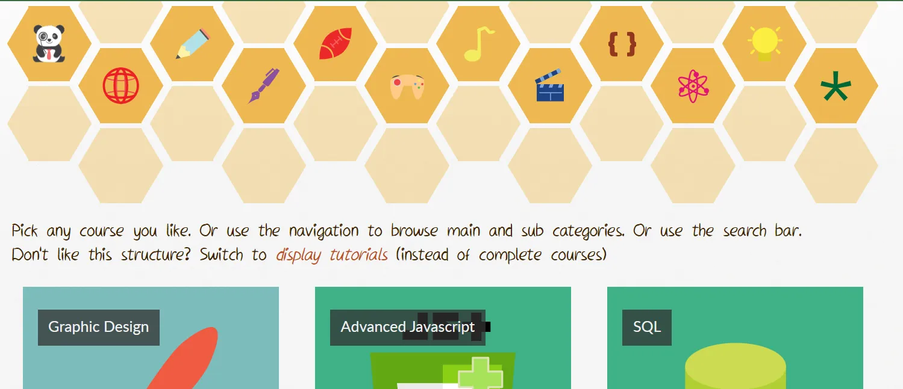

There's only a small button in the corner to "go to bottom". There, you'll find all navigation in the _footer_. So it's never in the way, but you also don't miss it.

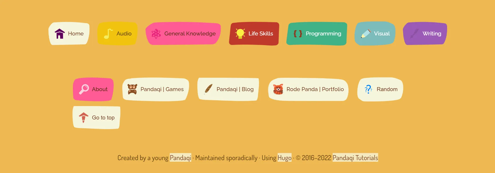

### Syntax Highlighting

As I said, I used tons of custom CSS and an external JS library to highlight code. Now I can do the same, but better and faster using just Hugo. So all that was removed.

This was the old code block.

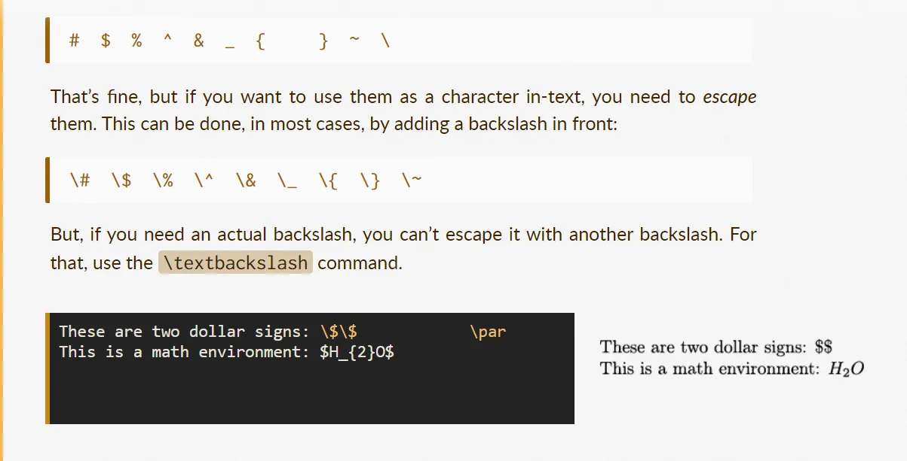

This is the new one.

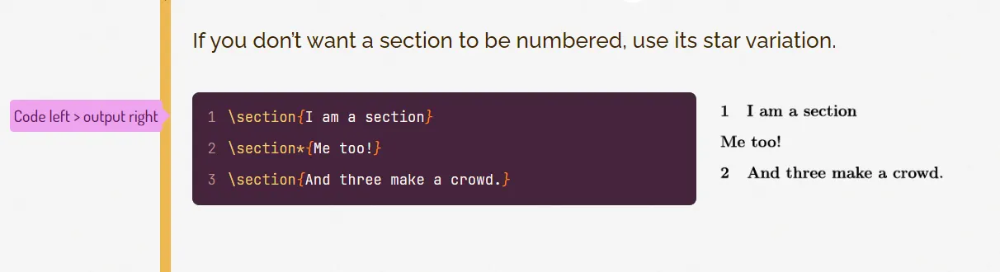

### Hyphenator

I thought it was a good idea to use justified text and hyphenate. I was wrong. Well, not entirely. It looks fine, and sometimes even great, because it fits well with the rest of the design.

An example of justified text in action.

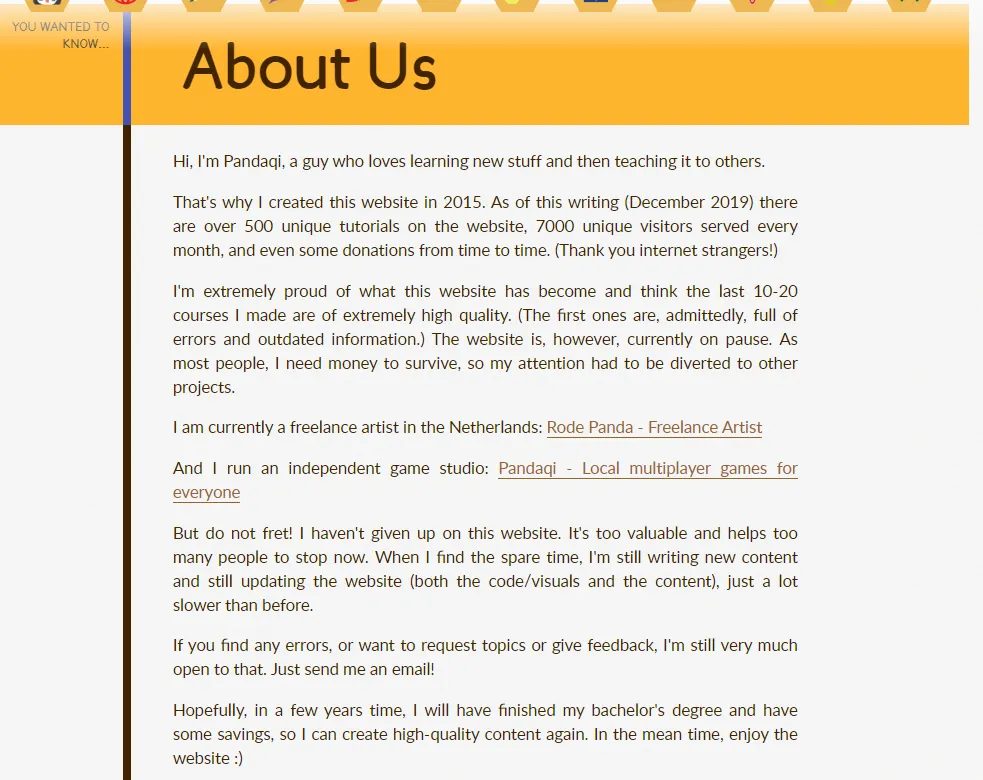

It was a bad idea, because I needed a _lot_ of custom PHP code and a JavaScript library to make it work. And it can create ugly gaps within the text.

Now, the text is just aligned to the left. If the browser _supports it natively_ (using `hyphens:auto;`), it is justified and hyphenated. Because this happens natively, the quality is much higher and it's much faster. (I don't have to do anything!)

The gaps in the lines of text are reduced as well, because I rewrote/updated many tutorials to use shorter words and sentences. So, in a sense, this clunky design decision _did_ reveal ways to improve my writing.

### Live editor

When I created this website, everyone that was _cool_ had its own live editor. Where you could immediately write HTML/CSS/JS ad play with it.

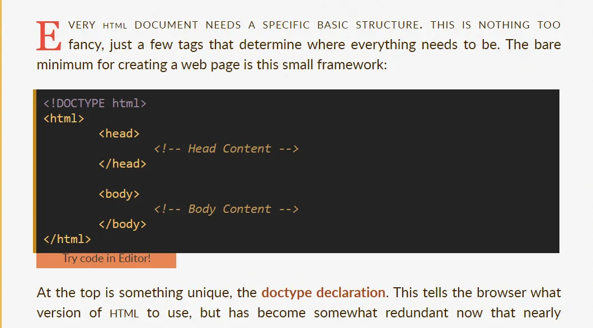

Now it isn't cool anymore. You can create websites literally anywhere. There are tons of amazing, free, well-known websites that are _much_ better than my half-hearted attempt at a live editor.

It goes away. (And the buttons underneath code blocks to "immediately try it" also go away.)

### No unnecessary libraries

Besides the ones already mentioned, I used 3 external libraries:

* Something to add controls (like pause, play, reverse) to GIF => I use WebM files now, which are proper video files and get their own controls.
* JQuery => never needed, vanilla JavaScript gets the job done and it's not even difficult
* MathJax => for displaying LaTeX on the page. Only a few articles use this. It's way too heavy for such a rare use case. And even then, I can just make a screenshot and place _that_ on the page.

All of these? Go away.

### Search

The old website had a search function. I even spend quite some time on it, to make it look good, accessible from everywhere, get fast results.

Below is an image of the search bar that was visible _at the bottom of EVERY page_!

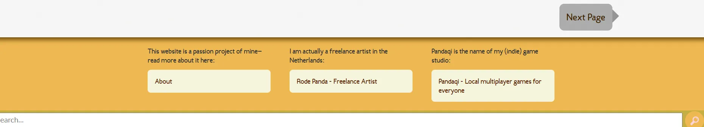

I don't see why on earth you'd need a search function. In the time you can type "visual design", you can also click on one of the many buttons for the "visual" category or the "design" course.

The website should be setup so that any content is easily found. Because the structure helps you. The chances of someone not finding anything, but then typing a magical keyword that leads them to some hidden tutorial, are basically zero.

It goes away.

### Small Caps

I used to be a big fan of those. So I used them everywhere on the website.

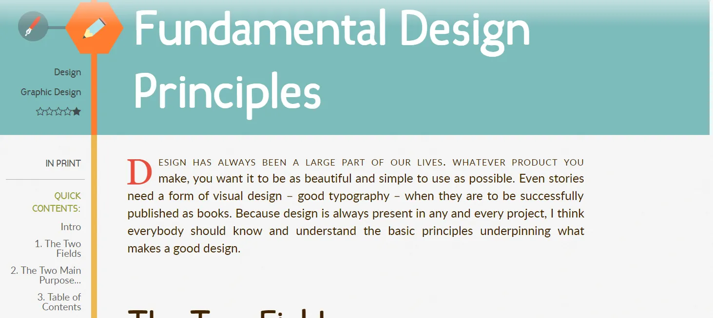

And again, it isn't bad, or cringe, or terrible practice. It's just not necessary and often hinders legibility more than it helps. 

Small caps went away.

### Donations

Underneath each tutorial is a block asking for a donation. These are three buttons, with different price values, that are simply dressed-up PayPal donation buttons. The ones you used to find basically everywhere.

How many donations have I received over the years? Three. Ten thousand visits a day. Six years. Three donations.

It just doesn't work. And the code for making this look nice (and work well with PayPal) is abominable.

Instead, there are now some simple buttons to modern well-known support website. And to my other work, because the best way to support me is simply by buying something I made that you like.

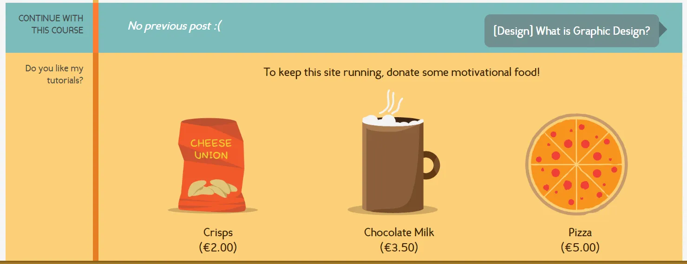

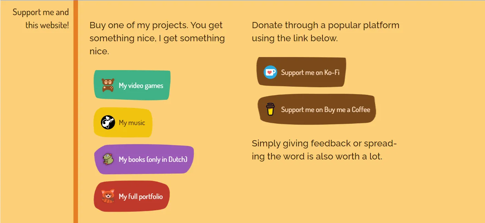

### Hexagons

The old website used a hexagon style. I think this is one of its strongest assets and still like it.

But back then, you had to hack your way to a hexagon. Now I can just use image masks, which are way more powerful and flexible.

(The size of this hack mustn't be underestimated. I literally saved _hundreds_ of lines of CSS here.)

So I changed that CSS. And then tried to find _as many locations as possible_ to reuse hexagons and reinforce this visual design.

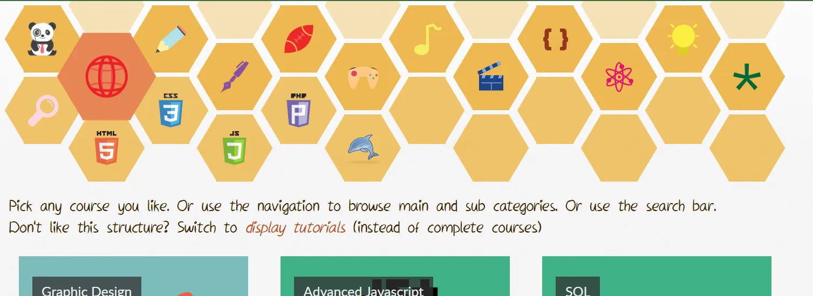

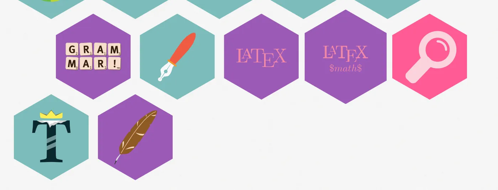

### Everything is a course, everything is a tutorial

Looking at the old code, it _constantly_ uses if-statements to check if something is a standalone article, or a course with many tutorials.

I can just remove this distinction. Everything is a course. It might have one tutorial ... and that's fine.

Similarly, the website had _two_ display modes for content: in a square grid, or vertically. You could switch between them, but I don't think anyone cares about that. The code was full of if-statements for this. Now I know better: _grid_ is great for _courses_, _vertical list_ is great for _tutorials_. 

This was the front page of the old website. Where I needed that sentence on _every page_, so you could switch between the two modes. (The default mode were these square blocks.)

So just use it like that.

(Additionally, because Hugo is a static website, I can't just switch the layout dynamically. I'd have to build two versions of each page. Or write some complicated JavaScript. So this feature needed to go anyway.)

### General texts

The old website had lots of text everywhere, explaining where you were or what a course was about. This is fine.

But it was a bit long and overwhelming. I forgot to update these texts. I forgot they were even there!

In the new version, I simply made everything _shorter_ and more _to the point_.

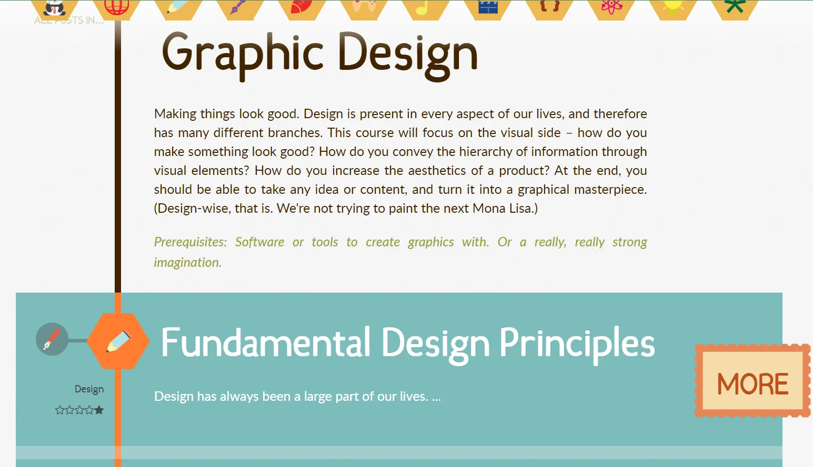

### Consistency with the main Pandaqi brand

The three websites (game studio, blog, tutorials) used to have wildly different looks. For some reason, it took me a few days until I realized this wasn't great, and that it was actually easy to solve.

For example, the fact that Pandaqi Tutorials used _four different local fonts_ didn't sit well with me. Then I realized that the body and header fonts already looked quite similar to those used for the main Pandaqi website! So I simply used the same combination (of two fonts) across _all Pandaqi websites_

Similarly, the main website has a strong visual style with "sketchy boxes" (how I call them) and "wavy patterns".

* Sketchy boxes are simply buttons with a background that's somewhat rectangular, but a bit ... sketchy. Not perfectly symmetrical, but more organic.
* Wavy patterns are created with a mask over the rectangular sections, but also with wavy _underlines_ for links.

Bringing these concepts to the Tutorials website solved many issues, while making the overall theming more consistent. (Before now, the tutorial website had like 5 different styles for links and buttons, used all over the place.)

You can see these sketchy boxes clearly in the new footer image I shared above.

## 4. Updating the content

Honestly, I've flipflopped between two extremes all these years. One says "most of these tutorials are simply bad, just destroy the website and forget it"; the other says "but the website is pretty, some courses are _really_ good, and maybe I want to continue in the future".

I wanted to update the content _a little bit_, just to soften the roughest edges. But looking at it for a bit longer, softening the edges just meant ... removing ten courses entirely.

You can clearly see when I figured out how to write well, how to design a good tutorial, when I started taking this project seriously. Everything before that is best forgotten, everything after it doesn't need drastic changes.

All the "bad" tutorials are in a hidden backup folder in the project. The "good" ones received some light editing, mostly on their first chapters. But I didn't want to spend more than a few hours on this.

It remains my oldest website and a big question mark in terms of "will I ever do anything with this again?"

### Outdated content

It's funny to read all the things I confidently stated back then. And which were mostly true! But now the world has changed an evolved---especially technology and programming languages---to a point where many tutorials are flat out wrong.

For example, I had huge courses on PHP and MySQL. Something I wouldn't ever recommend using today. Something that's still ubiquitous, but only because it used to be the only thing around the past decades.

I also had a list of all HTML entities. That list grew significantly the past decade.

I wrote a course on SASS ... without actually using it myself. Nowadays I'm a SASS wizard and that course just makes me want to die from shame.

I found a line saying "Use Sublime Text. It's all you'll ever need. Absolutely no reason to buy that expensive Adobe DreamWeaver". 

DreamWeaver, huh? Remember that? Used to be the big crucial software when developing for the web, everyone around me (who was interested in websites/coding) used it. Now I don't know anyone that even remembers the name. I also don't use Sublime Text anymore, but Visual Studio Code.

In summary: I tried to remove the worst offenders and update to modern standards where I could.

But if I want to make this website blossom again, I just need to write new courses. The quality of my writing has significantly improved. I would actually have 5-10 years of (professional) experience in the topics I talk about. There's a point when it'd be faster to write something completely new, than update the old shit.

## 5. Matching the old website with the new one

Now all I had to do was look at the old website structure and copy it to the new one. 

I removed lots of functionality, as I explained. This was both good and bad. It leads to less things to copy, it also means that I had to carefully read through and select _only the parts I wanted_.

Because I renamed all CSS classes in the stylesheet, I also had to rename them here. (It feels stupid when you do it. But I knew it would be worthwhile, because now the whole website is clean and consistent.)

As such, most of the time was lost figuring out which `
` element I'd missed this time, or slightly misspelling one of the fourteen classes just to create the donation buttons. 

That's why I changed a lot of the underlying structure in this phase as well. The old website was made _before_ CSS Grid was a thing. What used to be done using _tables_ (or `display: table;` in the CSS) with hundreds of lines, can now be done with a handful of Grid/Flexbox properties.
 
The websites don't match exactly. That's not needed. And I wasn't looking for a copy, I was looking for an _update_, an _improvement_ that would stand the test of time.

## 6. Conclusion

And that's how Pandaqi Tutorials was remade in Hugo. And now it exists proudly on [this website](https://pandaqi.com/tutorials/), together with the [Pandaqi game studio](https://pandaqi.com), and the [Pandaqi blog](https://pandaqi.com/blog/)

Most time was spent ...

* Duplicating the old structure, but now using Hugo partials/shortcodes and Markdown
* Converting a messy MySQL database into a hierarchy of Markdown files

Lots of Regular Expression magic helped a lot. Besides that, I "justified" this menial task by telling myself that I could now "improve" all aspects of it. If I have to copy each tutorial by hand, I can at least look at it and make sure I fix some mistakes or find other ways to make it better.

Now all my websites are small, clean, streamlined, and use the same Hugo system. The three Pandaqi websites live on the same Pandaqi domain. (I don't have to pay for pandaqitutorials.com anymore!)

The only bad apple that remains, is my [personal blog in Dutch](https://nietdathetuitmaakt.nl), which uses Wordpress. But now I know that WordPress converters exist for Hugo, so maybe one day ...