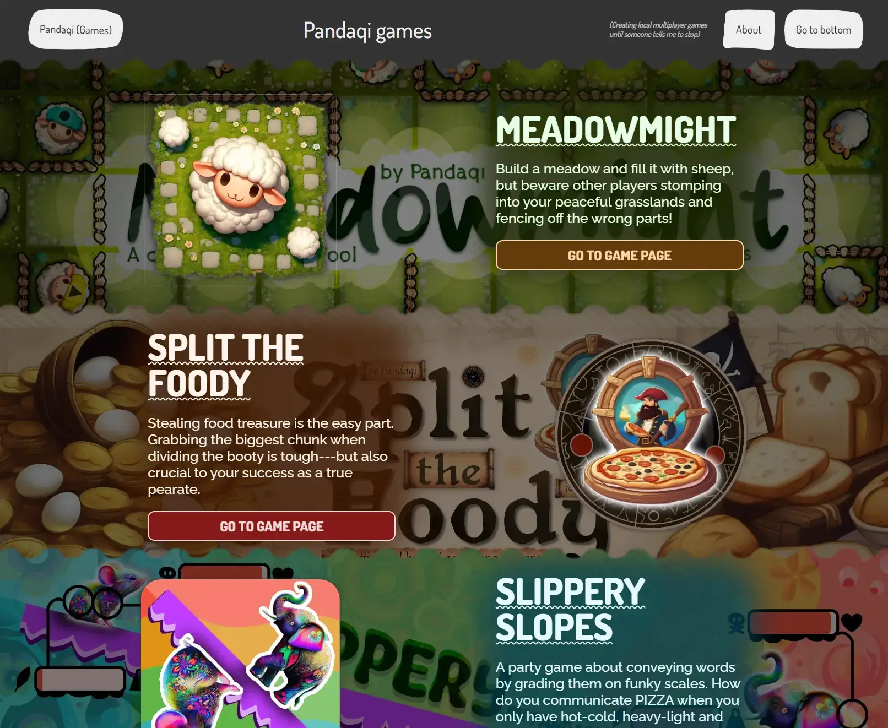
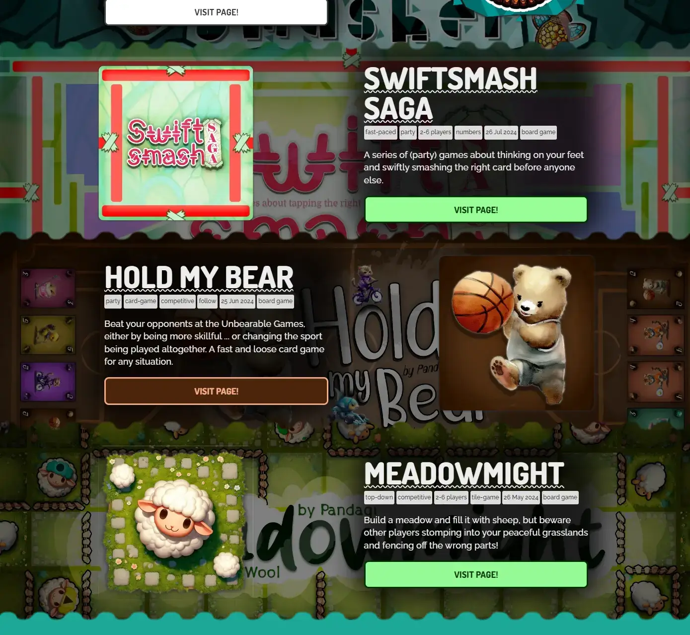
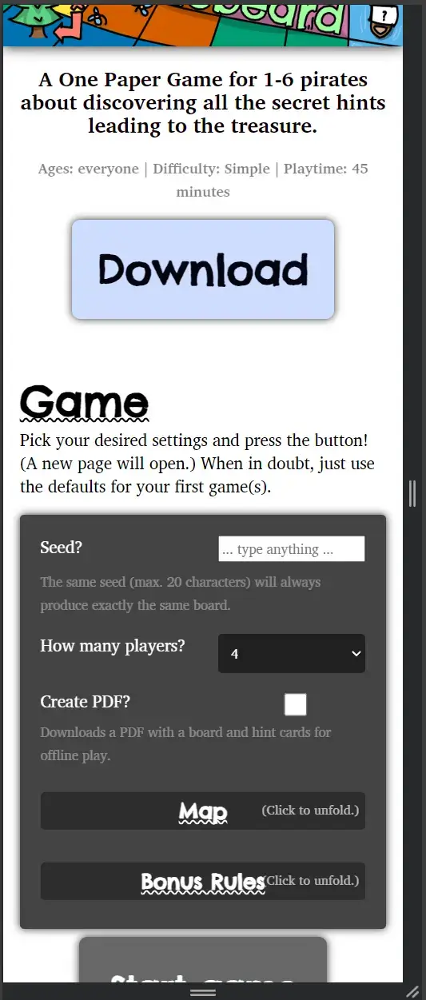
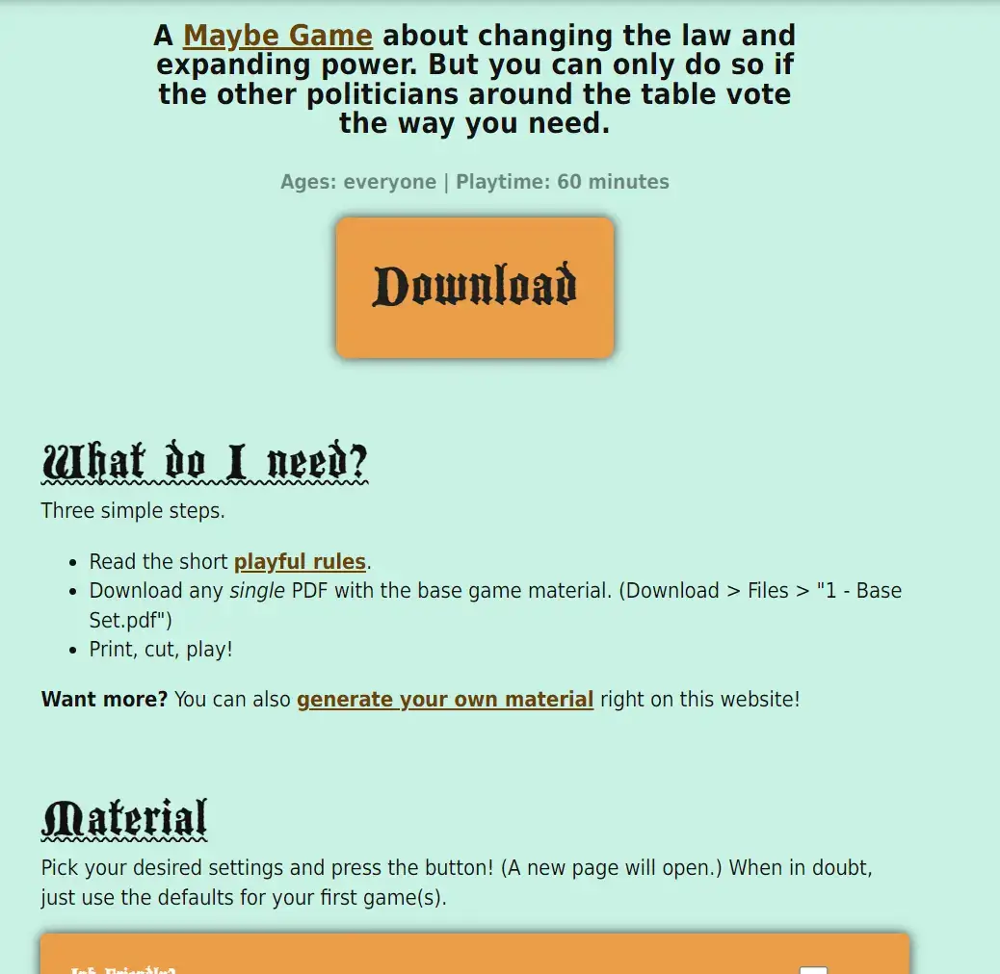

In this article I want to explain some pretty major changes I made to the Pandaqi website. What, why, how, and other questions containing the letter "w".

## The Problem: a lose-lose situation

When I set up the Pandaqi website, I wanted full control over the layout of each game page. I knew that I could make games look distinct, and better, and more appealing if I gave each page some unique graphics, colors, fonts, etcetera. I knew this because I always enjoyed the custom-designed pages on Itch.io and made some myself (for my own games) that I think attracted many players.

So I _still_ think this is a good idea.

But ...

* Back then, I had like 3 video games to put on the website.
* Back then, my productivity was far lower and there were no clear "patterns" yet to my work. (I was still at university, far less experience, far less professional and practical.)
* Back then, I primarily worked on my university laptop which had a terrible screen, which means I could barely judge colors/sizes/etcetera anyway and was too quick to call something "good enough".

What used to be a handful of games with their own `.css` file, has now turned into ...

* Nearly 100 games
* With _multiple_ `.scss` files per game. (One for the page, one for the rulebook, one for the game/generator page, perhaps a shared one to prevent repetition, etcetera.)
* And _multiple_ settings to update for every game. (Color of banner text, background and link. Overall color of the page. Etcetera.)

What used to be "good enough", just isn't anymore. I now have a proper screen that can properly display colors (and high resolutions) ... and I just don't think many of my old "custom designs" are actually adding rather than subtracting from the appeal :p

Similarly, launching a game just isn't a superduper special event to me anymore. I don't find the motivation or energy to create a _truly_ unique and stunning landing page for all of them. I don't think I ever will, as I am highly focused on _making more stuff_ and not _marketing it better_.

And so I ended up in a lose-lose situation.

* It takes _loads of time_ to add custom colors, fonts, visual settings, etcetera to _every page_.
* Whilst many of them don't _actually_ use this system for anything good and only provide some half-baked color scheme.
* And my broken computer refuses to build the website _at all_ (making it impossible to test things) half the time.

{}
I did settle on some "default styles" a while ago in an attempt to streamline this. But those were picked badly and implemented after many games were already done, so they didn't really help at all.
{}

This is the reason I procrastinate on going from 99%->100% on _every project_. One or two boring days of updating all the same page variables and colors and everything again.

This is the reason why some games still look bad. Or, at least, worse than if they'd just used a simple blank page with minimal styling. Because some games actually look _beautiful_ (if I really put the time into it), it makes all the others look _worse_ by comparison and due to inconsistency.

And this is the reason why the website is very slow to build---and sometimes crashes refreshing the styles---on my broken old computer.

{}
In addition to this, many pages even have the exact same text instructions for how to download and play the game, or the exact same settings for generating material. Copy-pasting this all the time isn't fun or the best approach.
{}

It's a simple matter of "the website was build to do one thing", but "now I have more experience and do completely different things".

This needed to change.

## The Solution: simplicity is key

### Banners

When you visit the front page, or any "list/overview" of pages, you get _banners_. 

* Each game is displayed in a big wide rectangle (with wavy top/bottom).
* The title + blurb is on one side, the game's icon on the other.
* In the background is the game's header.

By default, none of this has any other modifications. This is completely unreadable and too aggressive, of course, which is why basically _all_ games set `headerDarkened` to true (to, well, darken the header in the background) and set 4 unique colors for the title, text, etcetera.

Similarly, some of those oldest games did NOT have an icon or header, so I had to make an exception for those. Nowadays, I make more than enough graphics for everything and this shouldn't be needed anymore

**Simplification:** headers are ALWAYS darkened, the colors for the text are standardized to the same thing, and every game MUST have a header and square icon.

### Styles

I created a _sensible, minimal_ default style for the game pages. It's loaded by default, just black text on a white background. And if that's all the page uses, it still looks fine.

* Responsiveness (in font size, widths, etcetera) by default.
* Nice big headers
* Some basic changes to give things rounded corners, to animate links on hover, etcetera

In the metadata of game pages, I can set `invertStyles` to true. This simply means white text on black background, like turning on dark mode only for specific games.

Below is an image of one of my oldest games in this new default style. I made it in a period where I really wasn't feeling it, so the page was barebones and ugly, so I decided to just remove all styles and use it as the test ground for these default styles.

Then, each project should only have **one** `shared.scss` file. To make this conversion, I

* Simply copy-pasted the style rules from the other files into the `shared.scss` (that usually already existed)
* Sometimes, they `@use`d each other, which meant removing those rules and undoing whatever variable renaming I'd done.
* Updated the website templates to load it.
  * Before, it _searched_ for files with the right name first. For example, on the `game` page, it would look for `game.scss` first.
  * I backed up this code, as I'm quite proud of it and might need it later, but it's completely gone from the website for now.
  * Because, well, all those files are now just inside the one main file.

What is the purpose of this file?

* Load the custom fonts
* _Perhaps_ a background image or bigger change.
* _Perhaps_ some slight tweaks to sizes, colors, etcetera. (For example, some fonts look good when _bolded_ by default in the heading, while others look _awful_ that way.)
* That's it.

Yes, we **lose a lot here**. We lose all the custom colors and such, but as stated, they don't actually add enough to warrant all this effort (and a much slower, clunkier website).

Am I sad to see some of that work go down the drain? Sure! Some of those pages looked _awesome_, and I tried to preserve that anyway. But going forward, all game pages will have almost 100% the same default, neutral style.

### Don't Repeat Myself

All boardgames (except my first few) have the exact same instructions for playing them.

* Check the playful rules. (Always the same relative link.)
* Download + print the file called Base Set. (Or generate one yourself, always the same relative link.)
* Cut, play, have fun.

I can simply make this a default template to include with each game. (With some optional settings for a _custom remark_ or _removing the rules link_).

Similarly, the boardgame introduction could just grab the general blurb for the game. (Now I retype it every time in the content, perhaps shortened or slightly tweaked.)

Similarly, the game settings page can just print the same help text every time. (The settings themselves are wildly different between games, of course. So those will remain a manual input.)
* Almost all of them start with "Input your settings below and click the button. If unsure, just leave it on the default settings." => you guessed it, I copy-pasted this every time, but it should just be inserted by default!
* Almost all of them end with "Not working? No problem. Download PDFs I already generated from you from blabla" => insert this by default as well

The standard donation/support/feedback text is already a reusable template.

In this situation, I _still_ have to actually type the shortcode ( = a made-up keyword that automatically inserts this default text) on the game pages. This is okay for now. We will always need _some_ manual input and control, because each project is different.

Below is an example of a page (of an upcoming game) that completely uses those automatic templates.

As you can imagine, this shrank the size/complexity of this game page (and basically every other one) to just a few keywords and the custom settings for this game.

## Where are we now?

After applying these changes and making the conversion, the new website ...

* Has cut its number of `.scss` (style) files by ~75%. (This also means that the overall size of the website and the number of styles loaded/parsed every time is far, far lower.)
* Has way fewer parameters for the metadata of every page.
* Has consistent defaults that I can rely on, saving me one or two days of boring and pointless "finishing" of every project.
* Hopefully looks slightly more clean and professional across the board.

I also broke a few of the old pages, of course. Their styles were simply removed, or they now look weird because of a mismatch or changed default. I've tried to catch all of these errors, but some will surely only reveal themselves to me later. (Another reason for the simplification: this makes future updates far easier and less error-prone.)

We lost some of the uniqueness between games and some of that (very) colorful, busy style that all my projects seem to have.

But I think it's for the better.
* I won't procrastinate finishing projects any longer. (And it simply saves me work in general.)
* It looks more professional and clean.
* The website builds faster and allows updates more easily.
* Board games are much easier to implement and ship. Video games don't need any of this, because they have no rulebook and the game is simply downloaded.

Most importantly, _almost all games don't benefit from half-baked custom styles anyway._ I will only create a truly unique page for any _big_ releases. Everything else can look more uniform and place the focus entirely on the project itself, nothing else.

With these changes, I can still do that. Games still have custom styles and I can still put whatever I want in them.

For those who want hard data about this update,

* **Previously,** the main website refused to build on my old laptop half the time. If it _did_ build, it took 60-90 seconds. **Now,** it builds always again, in 25 seconds on average. (I'm sure I'll find a way to screw up again and ruin the building on my laptop in the future, but this is nice for now.)
* **Previously,** the website contained 2557 files (which includes enabling Hugo's automatic garbage collection/cleanup after building on the server). **Now,** the website contains 2344 files. This comparison is wildly unfair, though, because I also added 6 new, large finished games (to be publicly available later this year) with this update.

{}
Also, removing many custom/copy-pasted styles and rethinking my defaults helped me solve a few CSS bugs! For example, it turned out that line-height was being set completely incorrectly in rulebooks, which I "fixed" intuitively a long time ago by giving all rulebooks a way higher line-height (by default) than the regular pages. Which is obviously not a fix and still led to wonky results, with rules regularly having a few almost-overlapping sentences, which is just BAD.
{}

## What is next?

All of this was _also_ a precursor to a larger update I've wanted to make for a while now.

* Those "banners" should also show project metadata. (Such as "number of players" or "playtime", or perhaps "genre"/"type" for video games.) 
  * That's an important factor in determining if a user wants to click on the game and explore it further.
* The front page should not just start with the list. It should have some introductory graphic stating what the website is and welcoming new users. (The current layout is a bit in-your-face and perhaps confusing for completely new users.)
  * I delayed this for the longest time because I didn't know _what_ this introductory graphic and message would be, nor did I feel like doing some big detailed illustration. Now, with more experience, and generative AI to help, this is far more doable.
* I want to try a completely different style where all the games are simply displayed in a grid. I like this a lot on other website, and I've done something similar in my `boardgames` overview page anyway. 
  * This would remove even more of the website's unique look, but is simply another practical step forward. And in the end, I am a very _practical_ person.

We're finally working towards a future where I have a functioning computer and can make video games again. That's another reason for simplifying the website and making it easy to just "slot in" any small web game I end up finishing.

With the new system, it should ideally just be ...

* Create a new folder and `_index.md` page with the game name, metadata, and a default template. (With the game's header, blurb, and button to play.)
* Copy-paste the folder (if it's a web game) into the `game` folder.
* Otherwise, use the default template for download links (if it's a mobile or downloadable game stored somewhere else)

If I hadn't been in this situation, having a computer that simply COULD NOT run or develop games (for years), I would have never made this many board games. It is far more work to create the rulebook, rulebook images, playtest with others if any of it makes any sense, write the code to dynamically generate the material, etcetera ... than to just create a simple web game :p

Nevertheless, besides the mountains of work and the mess it created on my website trying to support that, I'm still happy I did it. I made many wonderful board games that anyone could easily play for free, spreading enjoyment and making board games even more accessible. Now it's simply time to recognize those were "small non-commercial projects" (that don't need their own custom styles, colors, etcetera), and alternate them with video games much more.

{}
Also, web games are simply the ideal compromise at this point of time. I can easily serve them myself on my already-established game studio website. Even bad hardware can make and run them. But if I want, I can _also_ convert them to mobile or desktop. Any other engine I ever used created web builds that were far too _large_, or had some clunky exceptions or processes for porting your game to _all_ platforms you'd ever want.

Or, well, the only platform that will probably never support these games are _consoles_. I've mostly given up trying to get a game on there in the next 5--10 years, though. Maybe consoles don't even exist anymore then.
{}

## Conclusion

I hope this explained the major changes and why I made them. It took several days of non-stop work to do _aaaall_ the conversion on all the projects, then fixing bugs and checking what broke. The several games I made after that, though, were already much easier to integrate and didn't have that "final hurdle" for me.

As stated, the website is never "done". There are more changes, more simplifications, more improvements to accessibility, etcetera. 

I'm more focused on _creating games_, however. And the website is completely free, giving me no income, so there's a limit to the number of updates I do to its structure each year.

Keep playing,

Pandaqi

