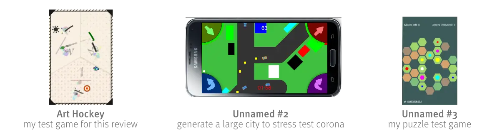
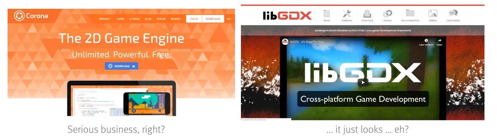
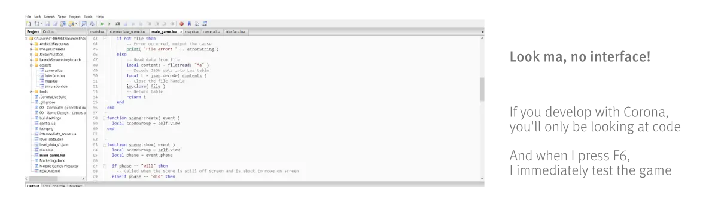
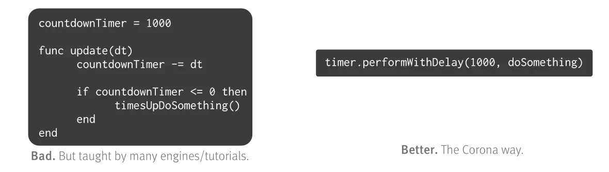

This is a review of the **Solar2D Game Engine**. 

Formerly, this engine was known as the Corona engine. But they changed the name for two good reasons: the "Corona Virus" struck the world and created some negative connotations to their name, and they decided to go fully free and open source.

This could be a very good step forward, or this could mean development will slow down. There’s no way to tell right now, although the first few months are looking very good!

With that out of the way, let’s see what I think of this engine!

For those who want the short answer: **it’s not perfect and has important pitfalls and obstacles to be aware of … but I like it a lot and will certainly use it in future projects.**

Here are some important links:
* [Solar2D Engine Website](https://solar2d.com/)
* [Statement about company shutting down](https://coronalabs.com/blog/2020/02/12/corona-labs-annual-update/)
* [Art Hockey: my first game released with Solar2D](https://pandaqi.com/art-hockey)

## What is Solar2D?
**Solar2D** (formerly Corona SDK) is a **free game engine for 2D games**, using the **Lua** programming language, and specializing in mobile games. 

(Before Corona Labs shut down, it was mostly free, but you had to pay to gain access to the source code and remove a few tiny restrictions. But as I just explained: that’s not the case anymore.)

I think it’s a good idea to occasionally try out new game engines, especially if you’re venturing into a new area or new genre. In my case, I had been creating games exclusively for desktop for years with the same engine, and wanted to try something new.

After some research, Solar2D stood out to me. Why?
* I had never made a mobile game before. This engine seemed to be focused almost exclusively on mobile games, which simplified a lot of issues I had beforehand.
* The website looked clean and up to date.
* The documentation (and forums) where extremely good. 
* I already knew the Lua programming language (not very well, but I had some experience). 
* It ranked high on many “top X game engine” lists and got a few personal recommendations on Reddit.

You might ask yourself: does it really matter if the website looks good or it has a few personal recommendations? Yes, yes it does. 

For example, the engine libGDX is mentioned and praised all over the place. But looking at its website and documentation … I just lose all the joy for making games. Could be just me, but that feeling/connection/emotion is a huge factor.

(Well, I’ll probably still try libGDX sometime in the future, especially because I already have Java experience. We’ll see then if this vague “feeling” of mine was correct!)

## “Testing” the engine
No, I’m not going to be creating “Pong” or “Flappy Bird”. I don’t see that as an accurate test of an engine’s capabilities.

I had a few (aka “too many to create in a lifetime”) ideas for mobile games. I picked the five simplest ones – not simultaneously, of course – and started to work on them.

I’m not going to explain all these game ideas in detail, because that would take up too much space, they’re still in development, and you don’t really need to know that information for this review. (Instead, whenever necessary, I will focus on the single game that is already released: Art Hockey.)

Suffice it to say that I made a _puzzle game_, an _action/arcade game_, a _strategy game_, and everything in between those genres. Almost all the games are local multiplayer (1-4 players). (That’s my thing.)

## \#1: Engine speed
The first category is “how fast do the games run?” 

I tried these three things to stress the engine (in a meaningful way):
* Used it to train a neural network
* Used it to randomly generate a big city and then drive through that with a car.
* Used it to create a platformer with loads of spawning monsters, objects and more effects. (If you’re making a local multiplayer platformer, the number of stuff will just quadruple.)
* (I tried to do another simulation, but it was way too slow for that and I had to give up.)

My conclusion? **“It’s really fast, but …”**

The engine uses **Lua**. It’s one of the fastest dynamic languages out there (or it used to be the past few years). Even when it was 12 o’clock and I wrote some code that was horribly unoptimized (like, three nested loops, at least), I didn’t see any stutters or framerate drops. Even physics-based games with loads of objects being created/removed all the time worked flawlessly.

However, when you’re starting to do serious work, you’ll need to think really carefully about your algorithms and data structures.

_Example:_ My “big city” I mentioned above, had about 50 nodes (“crossings”) with random streets between them, and buildings to the side. With regularly optimized code, the game ran at 20-30 FPS. I had to rewrite all the code, taking into account weird stuff from the Lua and Solar2D codebase, to get it to 60 FPS.

Additionally, sometimes I would add something extremely simple (like a block of text that contained a countdown timer), and the whole game would slow to a crawl. I often didn’t know why and just had to try something else. It seems like certain parts or implementations are, for whatever reason, wildly unoptimized.

So yes, you can get everything to 60 FPS, but take these cons into account:
* **Con \#1**: Solar2D does not use LuaJIT. (That’s a compiler that makes Lua waaay faster. The engine LÖVE uses it, for example.)
* **Con \#2**: Solar2D is extremely unoptimized in weird places.
* **Con \#3**: Similarly, the language Lua seems very cute and simple, but you can lose lots of performance if you don’t look further into how to write _good_ Lua code.

## \#2: Development speed
The second category is “how fast is the development workflow?”

The answer here is simple: **Fastest I’ve ever seen.**

Corona is, essentially, just a simulator. There’s no interface, no software that takes five minutes to start, nothing like that.

I use the free (and amazing) ZeroBrane studio to write my Lua code. My workflow for all Solar2D projects looks something like this:
* Start ZeroBrane studio (~5 seconds)
* Start writing code.
* Press F6 and test the game (~5 seconds)

This, to me, is _extremely important_. It means that I never had any big obstacles to jump over before I could start development. Whenever I had some free time, inspiration, or motivation, I could be developing the game in a matter of seconds.

It gets even better: Solar2D has **Live Builds**. The workflow for testing a game on my device became:
* Create a live build once.
* Put live build on phone. (I just use Android Debug Bridge and a USB-cable.)
* Any time I save the project, it’s updated and restarted on my phone within a matter of seconds.

I also can’t stress enough how nice this is. You just can’t accurately test mobile games on a computer, especially those reliant on touch input or OS specific functions, so being able to instantly test them on your phone means a lot.

_Note:_ I only tested this on Android (and Windows). But the process and functionality should be identical for iOS and Mac products.

## \#3: Ease of learning

I already knew the Lua language before I downloaded Solar2D. At first I was annoyed that much of the documentation I found was essentially just _explaining Lua basics_. I thought: "Yes, everyone knows this, but how do I do X and Y specifically?!"

This, however, also means that the engine must be very easy to learn for new (or inexperienced) users. If they spend so much time and resources explaining even the simplest things, I'm certain anyone will be able to understand it.

Once you've gotten to grips with _Lua_ (which should be quite quickly, because it's a small and simple language), you still need to learn how _Solar2D_ does things.

### No Editor

Solar2D does **not** have an editor, interface, or anything like it. It's purely code based. This could be a really good thing for you, or this could be a really bad thing.

Many people are used to interfaces on the computer, so creating a whole game without it might seem like an impossible task, especially if you're completely new to the game development business.

On the other hand, a lack of interface is exactly what makes the workflow so quick and easy. You don't need to start a huge, slow program before you can code. You don't need to learn the interface, the panels, the buttons. You can pick any text editor you like and be on your way!

So, to me, this is neither a pro nor a con.

### Some fine documentation

Remember this statement: _Solar2D has the nicest documentation I've seen so far_.

It's one of the reasons I chose this game engine. When developing a game, I spend at least 80% of the time with my nose in the docs and code examples, and I know it's roughly the same for all other developers. (Well, the holy trinity seems to be: documentation, StackOverflow, and random Q&A forums.)

When the documentation is clear, clean and complete, it makes life so much easier.

### But not perfect

I do, however, still have some complaints. (It's nitpicky, but this is a thorough review, so I think it's fair.)

I thought their documentation was nice and clear once you knew the engine a little. But until you reach that point, it's a bit of a grey area. Some parts of the documentation were in a weird order or explained in a way I found very misleading. I went the wrong way myself a couple of times, and I can only imagine it gets worse for people who are new to game development.

_Example:_ Solar2D uses something called "composer" to handle different scenes or game states (menu screen, game over screen, etc.) I spent _way_ too much time on this step, running into all sorts of mysterious errors. The system is just a bit … convoluted. You need to declare a few things in one place, and a few other things in another place, and then every state needs to declare four functions (even if you don't use all of them), and then the state needs to return itself at the end. (Don't forget that, it will frustrate you to no end otherwise :p)

Every game needs scenes/states, and it should be one of the most basic and simple aspects of setting up the game. But here I only learned about it in one of the last tutorials, and I basically wasted a whole evening on it.

Additionally, the documentation would sometimes be very vague. (I am a mathematician, I don't like it when things are vague or undefined!)

It would say something like "This is a number". Yeah, okay, nice, but WHAT KIND OF NUMBER? What's the range? What's the calculation? Where is it used? Is it an integer or a float?

_Example:_ for my game Art Hockey, I wanted each player to have a different "brush". The lines they were drawing needed to have a different texture, as if one player was holding a pencil and another an acrylic brush. It took me _ages_ to figure this out. Why? Because I assumed that texture scaling would default to 1.0 and that offset would work in pixels. It didn't. Textures will stretch to fit their whole rectangle, meaning the proportion gets out of whack. Offset works with values from (-1,1), relative to the texture size. Is that confusing? Yes.

Conclusion? **Documentation is near perfect. Lua is easy to learn. Solar2D is easy to learn … once you get past the first few obstacles**.

_Fun fact:_ I just did a quick search through all my projects for comments about the engine/systems. The phrases "confusing" and "because Solar2D" appeared 9 times. Apparently, there were 9 occasions where I was confused enough about the docs to leave a comment about it to myself.

## \#4: Ease of use

Maybe those "obstacles" in learning Solar2D have something to do with its general philosophy: **everything is event-based**.

It tries really hard to be different than other game engines. Fortunately, it often succeeds and makes life very simple.

For example, the number one thing you learn (or look for) in a game engine is the **update loop**. That thing that runs 60 times per second.

Solar2D tries to bury that update loop and make sure you never find or use it. I searched for the right syntax, but kept encountering answers/documentation saying "don't use an update loop; use events the way Solar2D wants". Finally, finally, I found the "enterFrame" event after thirty minutes. They really don't want you to use it.

And, after spending some time within the system, I actually like that. It requires you to already optimize your code and think of more clever ways to do things.

**Example \#1:** When I just started programming, I would put everything into the update loop. Need a timer? Just subtract "delta time" every frame! Need to check if an animation is complete? Check it every frame! Obviously, that was slow and bad. With Solar2D, they teach you to use events and callbacks for these common problems _right from the start_.

**Example \#2:** There's a function called "timer.performWithDelay()". Guess what it does? It performs a function with a certain delay. I've used this function a gazillion times throughout my games and was able to write nice animations and timed sequences _much_ faster than I used to do in other engines.

**Example \#3:** Similarly, almost anything in Solar2D has the ability to attach a callback function that fires when something happens (event is complete, button is released, collision has started/ended, etc.).

Once you get into this way of thinking, almost any task in Solar2D seems quick and easy.

One of the Reddit recommendations for this engine described it as "quick and dirty" – and it is. You can implement features or whole systems really fast, with the side effect that there will be loads of (callback) functions all over the place, leading to a mess of code if you don't add some structure at the start.

Conclusion? **Solar2D is easy to use and a joy to develop with, but … you need to understand the philosophy**  **and**  **create structure yourself**.

_What do you mean with "structure"?_ My first game with Solar2D had, at one point, a single file with more than 3000 lines of code. Horrible. But Solar2D gives you no indication, tutorial or guide on how to _split_ code into multiple files or modules. So I had to spend one whole day learning one such system and implementing it myself. Once I had done that, the project became waaay cleaner and I could develop even faster.

## \#5: Physics

Does physics need its own section? I think it does.

Why? Because I've had problems with physics in other engines. Things passing through each other, adding ten rigid bodies slowing the game to a crawl, and other annoying effects. (And, perhaps most frustratingly, people online saying "yeah, that's just the current state of our physics engine" and expecting me to be satisfied with that.)

With Solar2D, I had none of that. It uses Box2D and provides a simple interface for creating physics bodies, which means it's extremely fast (in-game and during development). I've never had an object pass through another, I've never had trouble finding the right property or setting to adjust my physics world.

_Example:_ Solar2D allows turning any "display object" into a physics body with a single line. This means almost all objects in the games took only a handful of lines to create, and from that moment everything worked smoothly!

Of course, there are still some issues. For example, you need to specify a radius to get a circular body (which took me very long to find out), but the object does not allow retrieving that radius, so you need to save it somewhere else yourself. But by now I think we can call that "Solar2D weirdness".

Conclusion? **Physics are easy to integrate and work flawlessly, but do make sure to read through all of the documentation**.

## \#6: Functionality

And finally we arrive at the big question: "will it magically make me a better developer and all my next games million dollar hits?"

I'm afraid not. I share that dream, like many developers, but I'm afraid we mustn't hold on to the thought that a new engine means a new me.

(This is half joke, half serious. I see many developers hopping from engine to engine, searching for … something, and they never find it. You just need to find an engine that you _like_ working with, and the rest comes down to skill and experience.)

The real big question is: "can it do what I need it to do?"

What's the answer? **Yeah … mostly**.

I don't know what you want it to do. Maybe you want to create the next Fortnite using Solar2D, or maybe you just want to create the next Pong.

All I can tell you, is what I think the engine is _meant_ to do and where all the functionality resides:

- Solar2D is for **2D mobile games**. Don't try creating apps or desktop games. Don't even think about 3D. You can do it, but there are way better options for that.
- Solar2D is for **very quick development/iteration**. The performance is good, but mediocre compared to some other engines. It can handle quite large game sizes, but don't get too ambitious. Corona is all about simplicity, speed, iteration – quick 'n dirty.

## \#7: Past, Present & Future

The Solar2D engine was developed in 2009. It has already had 10 years to grow and mature, which is noticeable. I've never had weird crashes, functions that did something unexpected, or complete gaps within the engine (or its documentation).

The engine, however, might be past its peak. Most of the Q&A entries I've found online were from the period 2000-2016. Since then, progress and activity seem to have slowed down, at least in those communities.

Is that a bad thing? Not necessarily. All those "old" answers were still relevant and solved my problem just as well. The engine is currently still up to date on all modern standards and requirements, no problems there.

As mentioned at the start, though, the company behind it is shutting down. This means the future is a bit uncertain: will open sourcing the project mean that less people are updating it, or more? Will making it free, offline and without restrictions attract many more users and increase activity again?

_Example:_ One of the annoying disadvantages of Corona _used to be_ that you need Wi-Fi to build your project for mobile. It needs to connect with their servers, do something there, and then return the result. This takes a lot of time. Too much time, one might say. However, now that the engine is completely free and open source, it is offline and this isn't a problem anymore! 

(Thanks to the developer, Vlad, for informing me about this update!)

Conclusion? **Solar2D is an established and mature engine, but its promising past does not guarantee a promising future. In other words: only time will tell.**

(On a more technical note: Solar2D uses OpenGL, which is dying if not already dead. Is that a problem? No, certainly not, almost all devices and engines still use it. Will that be a problem in, say, five years? Perhaps. Vulkan is taking over everywhere, even though it didn't even exist as an option a few years ago. The technical world progresses too quickly to keep track. If an engine is not actively maintained, there can be problems down the road.)

## Final Verdict & Recommendations

This is my verdict:

- If you're looking to create a 2D mobile game, make sure to give it a shot.
- If you're ambitious and want to create a huge game, don't use it.
- Instead, if you (like me) want rapid development, easy prototyping, and just quickly "getting something working" - Solar2D is a really good choice.
- There are some small hurdles to overcome. But once you've jumped over them, Solar2D is easy to use and will most likely have everything you need.
- If you're new to game development, Solar2D is a _good choice_, but maybe not the _best choice_.

_If you're completely new to game development_, this is what I'd recommend:

- Find a small and lightweight game engine … but with an interface. (I've tried to convince people that you don't need it and that it might actually confuse you. But if you've never programmed before, I completely understand that it's more comfortable to have an interface.)
- Start creating those "Pong" and "Flappy Bird" clones.
- Most of what I said in this review will probably not apply to you, so don't worry about that and find an engine you _understand_ and _enjoy using_.

_If you already know Lua_, things get a bit more complicated. There are many good Lua game engines: LÖVE, Defold, Cocos2D-x, Gideros, MOAI SDK, et cetera.

Picking the one most suitable to you will require a bit more research (or simply experimenting with them). Hopefully, in the near future, I can write a review on those as well.

_If you have any feedback or want to see other engines reviewed_, let me know. This is my first game engine review I've ever written, but I try out game engines regularly, so I think I can write a lot more about this topic.

So that's it!

I hope you've enjoyed this review, maybe learned something from it, and know whether Solar2D is (or is not) a game engine for you. If you're still unconvinced, please read the compilation of _success_ and _horror stories_ in this article: [Solar2D Engine - Real life stories](https://pandaqi.com/blog/reviews-and-thoughts/solar2d-success-and-horror-stories/)

Until the next time,

Pandaqi

P.S. If you're wondering about those other (yet unfinished) projects, they are coming along nicely. I just wanted at least _one_ released game before I wrote the review. The other games are bigger and more promising, and I want to give them as much love as I can before releasing anything about them.