The past couple of years, more and more "logic deduction boardgames"
have appeared. Most of them are very simple, yet have become wildly
successful and popular.

Human beings are natural problem solvers, so games like this speak us
and are easy to learn.

I'm interested in these games as well. Some years ago, I "invented" the
idea of *hybrid games*: boardgames with an essential digital component,
usually in the form of a smartphone doing some of the work.

(Obviously, I didn't invent this idea. More and more boardgames use
companion apps. I never officially published a boardgame in my life :p
But when I made my projects it was still quite rare, and the techniques
I use are different than what other games do.)

I already made a game that *somewhat* uses this technique: [Wondering
Witches](https://pandaqi.com/wondering-witches)

But the deeper we get into this, the more
you'll see how that project doesn't really fit this genre or the
techniques I will discuss.

So I thought: why not try my hand at creating such a logic deduction
game?

This article chronicles my complete journey from start to finish.
Figuring out algorithms, solving issues with them, displaying the
results. I find that the *best* way to teach something and really show
how it works.

I used the techniques discussed to create actual, playable, free
boardgames you can find on my website.

* [Pirate Riddlebeard](https://pandaqi.com/pirate-riddlebeard) (uses technique 1, in this article)
* [Pirate Drawingbeard](https://pandaqi.com/pirate-drawingbeard) (uses technique 1, in this article)
* Pirate Spacebeard (coming soon, uses technique 2, from next article)

## What are they?

Each player is dealt a *unique* card containing hints. During the game,
players obviously may not communicate or show these.

Only when you combine *all* the hints, will they point to the solution
to the problem at hand.

For example: in the game *Cryptid* you're searching for a mysterious
monster on a map. Each player has a card with hints like "it's on a
water or desert square" or "it's at most two tiles away from X". Your
hints alone aren't enough to find the right tile. But figure out the
hints that *other* players have, and they will point to *one* unique
square on the map.

You can approach this idea in two ways:

-   **Passive:** use a fixed map, let the game pick a location, then
    generate hints that uniquely point towards it. Players are merely
    *figuring out the answer*.

-   **Active:** allow players to *change* the map to make it conform to
    whatever hints or instructions they have.

You can also choose how mathematically precise you want to get:

-   **Precise:** all hints point to exactly *one* solution, no hint is
    unnecessary

-   **Intermediates:** there are intermediate goals that add an extra
    layer. For example, the map might have multiple *small* hidden
    treasures. Some hints point to *their* location, while other hints
    say something like: "the big treasure is 2 tiles from a small
    treasure"

-   **Fuzzy Solution:** there might be multiple solutions, which can
    make the game easier or harder\* (depending on the rest of the
    gameplay).

-   **Fuzzy Hints:** add unnecessary hints to add some chaos into the
    mix, makes any game much harder, but also more frustrating

-   **Chaotic:** fuzzy hints, fuzzy solutions, and players might even be
    able to *change* these.

\*At first, you might think multiple solutions make the game *easier*.
You don't need to be as precise, you maybe don't need all the hints, to
find *a* correct solution. But on the flipside, you'll never know when
you're done. Let's say there are 10 possible locations left ... are they
all a solution? Or are you simply missing one hint? The extra
uncertainty will often make games harder instead of easier.

## What am I going to do?

I'm going to program some algorithms to create solutions and unique
instruction sets that point to them.

I'll talk about *how* I approach a problem like this, *how* I solved it,
what *different* techniques you might use.

I'll do this using **JavaScript** and the **Phaser** framework. (As I
did with all my other games. It means you only need one smartphone with
a browser + Wi-Fi to play a game like this. No need to install an app.)

And I'll use these algorithms to design two game ideas I had. At this
point, I'm not sure if that *game* is going to work or be fun at all,
but it's always good to have a practical goal in mind when working on
tough problems like this. To have some context for what you're doing.

(All my board games can be found here: [Pandaqi Boardgames](https://pandaqi.com/boardgames). To view their code, simply open the inspector and view the JavaScript files. Nothing is hidden, it's all standard website stuff.)

## Why are they so interesting?

I see several reasons why these games are so well-liked.

**Reason #1: Humans are problem solvers.** It just happens
automatically. This is also why *clickbait* is so effective: once a
story is started ... we just *need* to know how it ends. Once a question
is asked, we just *need* to know the answer.

A question as simple as "which location on the map has the treasure?" is
enough to engage anyone.

**Reason #2: Everyone is constantly active.** Because everyone has a
part of the solution, you have to pay attention and stay focused all the
time. Each turn impacts you directly. Games like these regularly ask
players to say if they agree/disagree with the current solution based on
their unique hints (even if it's not your turn at all).

**Reason #3: Humans like a sense of ownership and individuality.** By
owning a *unique* set of hints, which only *you* know, you feel more
valuable and powerful as a player. And that feeling is completely
deserved. You *are* essential to the game.

(The exact hints for a scenario depend on player count, for example.
Changing from 3 to 4 players will completely change what hints are doled
out.)

**Reason #4: Easy gameplay.** Because all the complexity was done
*beforehand*, by creating the actual scenario, the game itself is very
easy to learn and play. It usually involves a handful of actions for
*asking information in a specific way* or *adding/removing anything from
the board.*

(The details of these actions *are* what make the game, and are often
highly thematic and intuitive. For example, in "Search for Planet X",
you try to, well, find the mysterious planet X in a universe built from
18 sectors. Almost all your actions are simply about picking a range of
sectors and asking what's in there.)

## Approach #1: Treasure Hunting

I'm drawn to the idea of adding more "gameplay", more interactivity and
chaos to these games. But that's obviously really hard and experimental
to do.

So let's start with the simplest core variant: **a passive precise
game.**

And let's use a very straightforward theme: **treasure hunting.**

There's a map of square tiles. Each tile has a terrain: grass, water or
sand. Each tile *can* have a landmark: a building of height 1 to 4. Each
tile *can* have nature: trees, shrubs.

We can just randomly generate one for this purpose. And then we randomly
choose one tile to be the location of the treasure.

Most algorithms can be written in two ways: *forward* and *backward*.
We'll explore both, but first we need to determine what "hints" even
mean.

## Hint Types

Hints are simply *any* statement we can think of that tells you some bit
of information about a location on the map.

So we have hints for terrain ("the treasure has terrain X", "the
treasure is NOT on terrain Y"), landmarks, nature.

Hints can be about the tile itself, but also its surroundings. ("The
treasure is at most two tiles from a landmark", "there are 3 landmarks
in a radius of 3 tiles from the treasure")

As long as they don't become too complicated, or their numbers too high,
any of these ideas are fine.

## Generating Unique Hints: Backward

**It's the simple but naive approach: we generate a random set of
hints!**

**We *start* with hints, then work *backward* to *end* on a location.**

For example, with 4 players, we say 4 hints each. This means we generate
16 hints from that list of possibilities. Completely randomly.

Then we check these hints against *all locations on the map* to find
which locations comply with all these requirements.

It might be 0. It might be 10.

We're happy if we find exactly 1.

### Problems & Solutions

There's one terrible issue with this: **the probability of stumbling
upon a perfect solution is terribly low.**

**Problem #1:** hints might contradict each other directly.

**Solution #1:** Don't allow this. If we already have a hint stating
"the treasure is in the water", we don't generate any more hints saying
the treasure is in some other terrain.

**Problem #2:** hints might all be "samey". They might all talk about
terrain and landmarks, and not a single one about nature, removing whole
parts of the game.

**Solution #2:** divide the hints into categories. Force the algorithm
to cycle through all categories when picking hints.

**Problem #3:** if a solution exists, we're likely to find multiple.

**Solution #3:** pick one solution as "the real one" (preferably the one
furthest away from all the other solutions, as it's least likely to be
influenced by them), change one aspect about all the other locations so
they don't fit anymore.

**Alternative Solution #3:** keep adding *more* hints to exclude the
extra solutions, until one remains.

### Optimization

While implementing, I figured out a huge optimization that *also*
mitigates the problems above.

Instead of generating *all hints at once* then checking them against
*all cells* ...

... we can generate hints one at a time, and strike off any location
that doesn't fit as we go.

It's a simple loop:

-   We create a random hint.

-   We check it against all locations and save the ones that are valid.

-   Repeat for each hint, shrinking the list of possible locations as we
    go.

Once only *one location* remains, we stop. (If none remain, or we've
exceeded some maximum number of hints, we just stop and retry
completely.)

Why is this so much better?

The list of locations only shrinks over time. Only the *first* hint is
checked against the *whole* map. The second one is only checked against
whatever remains, and so on.

Instead of checking 16 hints against 128 squares ( = 2048 checks), it'd
be like

-   1 hint against 128 squares

-   1 hint against 50 squares

-   1 hint against 12 squares

-   "Hey, only 1 square remains, solution found!"

This also reveals the second benefit: *if* a solution exists, we'll find
it *as quickly as possible* (with the minimum number of hints).

Below was the first map I received after creating this system, and also
the very first one that *actually* provided a solution. (I'm writing
this section "in the future", because it took me a few days to realize
this optimization. So don't worry, I'll explain more about this map
later on.)

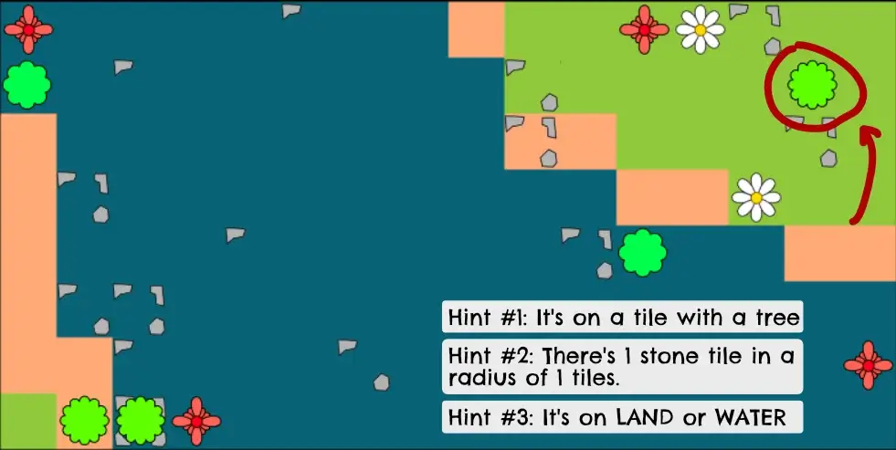

So yes, this works great. We now have proof that this technique is
viable. It's also very, very fast to compute.

The problem is that it only renders a solution once every 10-20 tries,
and they are often very stupid. (Like, only a **single** ridiculously
specific hint is needed to find the location.)

Being such a fast algorithm, though, this still means we get a solution
within 50 milliseconds.

Here's the next one it generated. **Play for yourself!** Find the single
tile that fits.

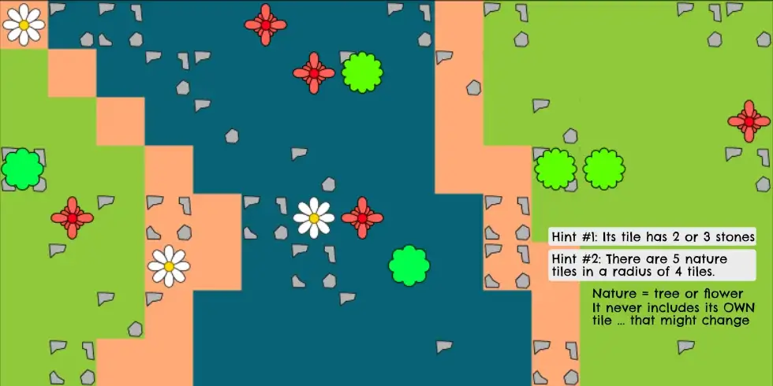

But let's not get ahead of ourselves, read on!

### How's that? 

It's a very imprecise algorithm. You're not certain to find a solution,
and finding a unique one is even harder.

If you're lucky, you'll find a great solution in 1 second, with very
little code. If you're unlucky, the computer might be thinking for 5
minutes and still come up empty.

But let's see it in practice.

**First Try:** no solutions were generated at all. The hints were too
specific and too wild.

For example! Hints like these regularly appeared: "There are 5 landmarks
in a 1 tile radius." This simply isn't possible. In a 1 tile radius we
can have at most *four* landmarks (one on each neighbor).

Conversely, a hint like "there are 0 landmarks in a 5 tile radius" is
unlikely to be true, as that's a *very large* area to cover without
finding *any* landmark.

But that isn't the biggest issue with hints like that. It's that those
hints are *very precise*. There's no leeway, no wiggle room, any tile
with 4 or 6 landmarks around it won't cut it.

The same issue is present in all other categories, which, when combined,
means the computer never finds a suitable tile. No matter how hard it
tries.

(All other parts were working fine and efficiently within an hour or two
of coding. But even when I only used *1 hint* it often wouldn't find any
suitable location with this system.)

How do we fix this? We need to change hints to things like this:

-   Multiple options: "It's on terrain X or Y"

-   Thresholds: "There are between 5 and 8 trees around it"

-   Greater/Less than: "It has at most 4 landmarks in a 3 tile radius"

How? In the hints I store a "secret parameter". This is the "random
offset" from the real value that we used. This way I can easily check if
a location fits the hint: \<real number> + \<offset> should be the value
shown in the hint.

(I also sense I should've focused on terrain much more. By adding more
terrain types, the map becomes prettier, and these hints more diverse.)

### Second Try: Better Hints

I removed all hints that were just stating an exact piece of
information, like "the treasure is on terrain X". Just never a good idea
in a game like this.

I rewrote other hints to be more vague. And I invented some extra hints
that I thought were nice, like "terrain diversity" which counts how many
different terrains are around the treasure.

For that to work well, I had to bite the bullet and implement more
terrain types into the game.

I also had to step away from the idea of a "realistic pirate map" (with
islands and water around it). This leads to terrain that is too
*uniform* (big blobs of identical terrain), and I obviously can't place
structures or trees in the water, eliminating half the map before the
game even started.

I realized that it was basically becoming more and more like the game
*Cryptid*. (And in doing so also learned *why* they designed that game
the way they did :p)

I'll have to worry about being *different* from that game at a later
stage, for now I just want to get a working algorithm. (We're already
quite different due to how maps are generated, the variety of hint
types, and the fact players can have more than one hint.)

For now though, I'm focusing on the better hints.

I only changed the visuals to make it easier to see for *me* when
debugging. I realized I needed to draw everything *from above*, and
needed easy icons so players could easily draw them themselves. This
resulted in ...

-   Nature can now be a *tree* or a *flower*.

    -   (Easy to distinguish and draw for players.)

-   Landmarks are replaced with *stones*: there can be 1 to 4 stones on
    a single cell.

    -   (How do you draw top-down houses that can have 4 different
        heights? I didn't know, so I changed it. Also, the stones are
        drawn in such a way that there can *also* be nature on that
        cell.)

How's this?

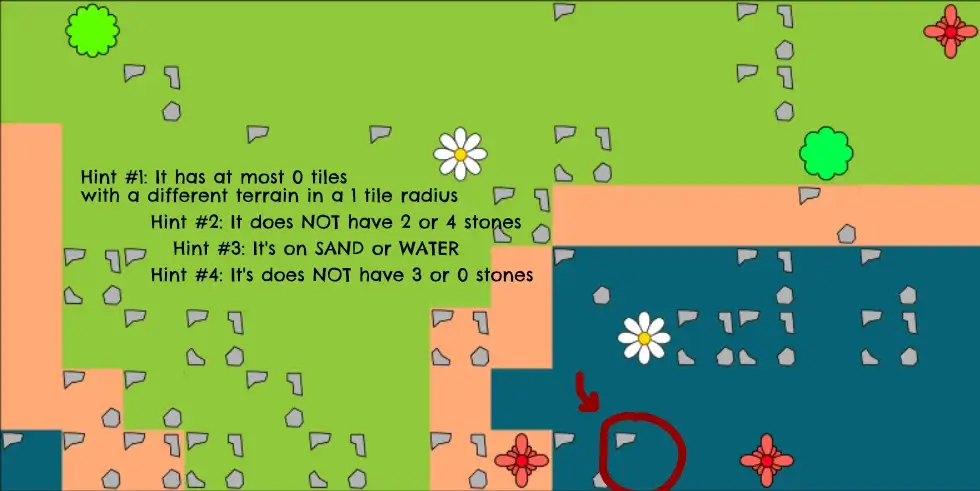

(Obviously, I need to change the numbers so we don't get "at most 0" or
similar situations. That's a small fix. I also need to tell certain
hints (such as "NOT X or Y stones") to only appear once.)

The system is already quite powerful! Here's the next one I generated
after these fixes, play it for yourself.

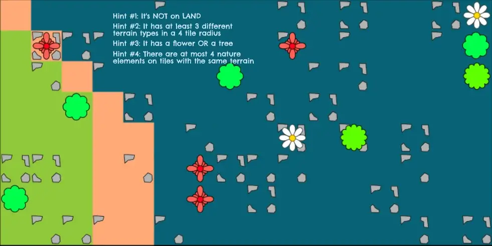

(Solution? The one sand tile with a flower.)

Better, but not good enough yet.

The most important element of a game like this remains *the map itself*.
If it's not varied enough, or too symmetrical, or has other clear
issues, then you will *never* find a good set of hints leading to a
unique location. So let's completely focus on that now.

### Third Try: Better Maps

I spend some time writing a better generator for the maps.

For example: ensure terrains are well-balanced (count terrains, none of
them is allowed to have too few or too many tiles).

I considered changing to hexagons (more connections per tile, more
intuitive way of counting distances). But I want to keep it as simple as
possible. And I usually make games people could play with a piece of
paper, and those are still very much a rectangle.

But I just wasn't happy with all of this. The problems with this type of
map just kept stacking up.

So I completely changed the *kind* of map and how we generate it.

-   I invented 6 terrain types: water, grass, desert, mountain, swamp,
    and snow.

-   At the start of generation, I place two or three dots of each
    terrain randomly on the map.

-   Then I "grow" these one tile at a time ...

-   ... until every tile on the board has a terrain!

The growing ensures terrains come in nice groups/chunks. For each
terrain, I'll draw a slightly different sprite for trees and such.
(Example: desert gets a cactus.) And the water terrain can't have nature
or stones.

We lose the "natural" or "realistic" look we had, but in return get a
map that's way more diverse and suitable for a game like this.

Simply by adding more terrains, we already get things like this:

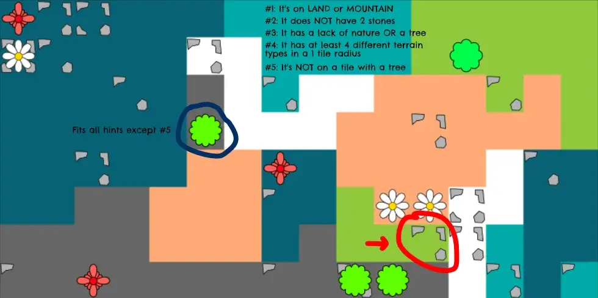

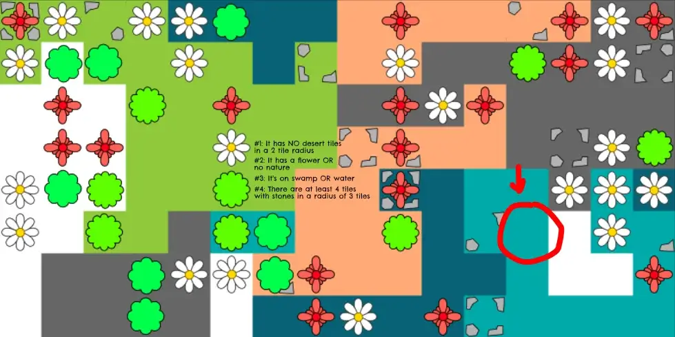

Two issues remain:

-   The placement of other elements (stones, nature) is very bad and
    ugly.

-   Some hints are clearly "more valuable" than others

At this moment, I don't see an easy way to fix the second issue. That's
the problem with the backward technique: we start with random hints and
just hope to end up somewhere. Some of those hints might not be amazing.

The first issue is a matter of experimenting with how I want the maps to
look and putting more effort in the drawings.

### Final Version

I've learned over the years how important it is to have really unique
elements in a project, that only appear (or make sense) sporadically.

It just gives a more human and memorable touch to the game, to the
things it generates.

As such, I decided to finish the maps in this way. All elements below
are *optional*, they *might* be present:

-   Add only one or two "special buildings".

-   Add a "road" or two. This is just a random walk through the map.

-   One pirate ship, in the water.

When not present, it simply removes all *hints* related to these things,
so they're not generated.

There might be games where the road(s) or special building(s) don't
matter at all. But you *don't know* beforehand, so they are still an
important part of the game. And they definitely make maps looks more
interesting and diverse.

I heavily scaled back how much nature and stones are placed, and placed
them in tighter groups.

I also thought more about incorporating the algorithm in a full game in
the meantime. Which made me realize how we needed a *waaaay* smaller map
and a completely black-and-white version that's easy/quick to copy to
your own paper. (I talk about these things in the devlog for the game
this ultimately became: Pirate Riddlebeard.)

So this is the final version:

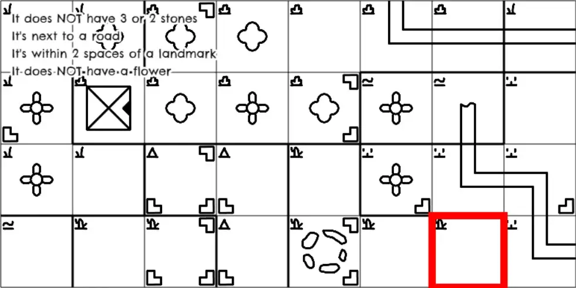

It generates the full game within less than a second. Never fails, works
everywhere.

It does need *many* retries: at least 10 or 20 in most cases. Most of
that number comes from the *map generation*. As such, it's way more
likely that generating the random map will fail (due to constraints I
set that should keep the game balanced), than our backward hint
algorithm failing.

But because the calculations are relatively simple, the maps small and
simple, this should be no problem for any modern device to do in a
fraction of a second.

## Generating Unique Hints: Forward

The forward approach, as you'd expect, moves in the opposite direction.

**We *start* by choosing a location, then go forward with that to
collect all hints pointing to it.**

Initially, this may seem preferable to the previous approach. The
obvious better and cleaner solution!

### Problems & Solutions

That's true ... for the most part.

Picking one location and generating all hints is easy to code and fast
to execute. You just run through all hint types you invented, calculate
what they should be, and save that.

You're also *certain* they won't contradict each other. And you are
*certain* the hints have at least one solution.

The next part is hard, though.

**Problem #1:** this results in *loads* of hints. Most of which are just
*slightly* different from others. ("The treasure is at least 2 tiles
away from water", "The treasure is at least 3 tiles away from water",
...)

We can't give each player 50 unique hints :p

**Solution #1:** Hints with a *number* should just pick a random one,
though preferably near the "extreme" to keep the hints tight.

Hints with discrete options (such as a specific terrain) should bundle
them: the treasure is NOT in water OR grass.

**Problem #2:** the hints might still point to *other* solutions as
well. Or, more likely with this many specific hints, it might *too
obviously* point towards the treasure.

**Solution #2:** you can actually solve this in a way that almost
entirely solves problem #1.

Repeat this loop:

-   Check your current set of hints against *all* locations.

-   Only find one solution? The hints are too narrow, remove one at
    random.\*

-   Find multiple solutions? Stop! The *previous* set of hints was
    perfect.

\*Instead of random removal, it's probably better to alternate between
categories again. Ensures hints are nicely distributed and stay unique
to one solution as long as possible.

The only reason we don't do this (instead of solution #1 as well) is
because it's *very expensive* to calculate all this. We want to have a
reduced list of hints *before* doing this loop.

### Implementation

I already had all the code for maps and hints from the backward
technique.

There's one big difference I had to figure out.

In the backward technique, we fill in random numbers. When we check a
cell, we fill in the same random numbers, but overwrite anything
specific to the cell.

In the forward technique, we want create a unique hint for *each
possible combination of numbers*.

Let's say we have a hint of the form: "There is X nature within a radius
of Y tiles"

The *radius (Y)* is a number we need to fill in ourselves! (The value
(X) is what's being calculated for the specific cell.)

-   We need to specify the *range* such a number is allowed to go
    through.

-   And then we need to write a loop to create a unique hint for each of
    those values.

In this case, I might say "the radius must be between 2 and 4". Which
should result in 3 unique hints: "there is X nature within a radius of
2", "there is Y nature within a radius of 3", and "there is Z nature
within a radius of 4"

### How's that? First try

As expected, it's more robust and streamlined than the other approach,
but also much slower.

With my current set of hints (\~6 per category, three categories), *on
average*, ...

-   Generating *everything* yields 130 hints

-   Whittling it down takes 1 second

-   Which means we end up with 5-15 hints

As you can see, it takes longer, and leads to *bigger* instruction sets
than the backward technique.

Here's an example, made using the old visualization of the map. (I
developed the forward and backward algorithms parallel to each other,
for some time.)

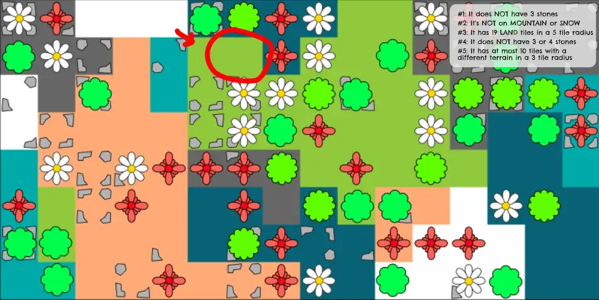

We see that some hints are just too specific and hard. (19 tiles in a 5
tile radius!? Let's shrink the maximum radius on that one!)

We also see a duplicate on the "NOT stones".

### Second Try

Let's add the improvements and see what we get:

-   Lower the radius on many hints. I think 3 tile radius is a clear
    maximum, and *maybe* even that is too large.

-   On hints that have *many* variants, randomly remove half of them
    before we even start whittling down the list.

    -   (Example: "it's not on TERRAIN A or TERRAIN B". There are loads
        of 2-terrain-combos on which the treasure *is not*. But we only
        want this hint to appear like once or twice, and it doesn't
        matter much which combo we pick.)

-   Add the *margin of error*. When a hint says "at most 2 tiles", it
    currently just means "exactly 2 tiles". When generating hints, I
    need to add/subtract from numbers to create that margin of
    uncertainty.

-   Alternate categories when removing hints. (Or you might end up with
    10 hints all about nature and nothing else, which is rarely what you
    want.)

But, when I was ready to test this ... I realized I was being stupid.
Well, I was being stupid about one of these points.

We can do the same thing as we did with the backward technique!

Add 1 hint at a time (from the list of all the possible hints, which we
just made), until our hints only point to one location!

(We are *certain* this will happen at some point, as all our hints point
to exactly one location, and any other solutions are just accidental.)

What does this get us?

-   The reduced list of hints is \~50 long

-   It usually finds a solution first try, within a fraction of a second

-   (I've already restricted it to keep the number of hints at a nice
    length; 1-2 hints per player.)

Below is the first map generated this way:

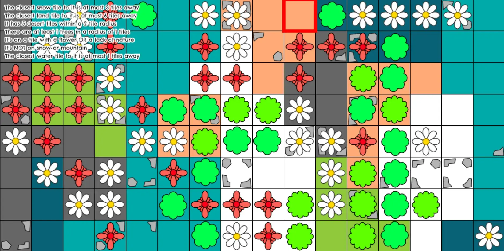

Pretty nice. Hints seem equally valuable, but also not too specific. It
can generate these *really* quickly, and they are always really
different.

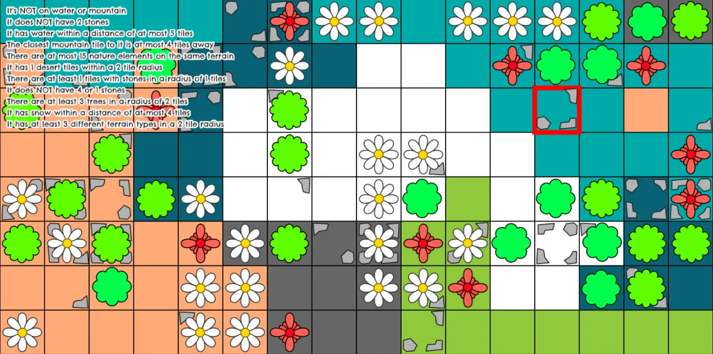

Every hint has *some* value. For example, "there are at most 15 nature
elements on the same terrain". This is true for all terrains ... except
desert ( = orange). It actually has 16 squares with nature on it.

**Compared to the backward algorithm** ...

-   I had more trouble implementing it. (It's way harder to generate a
    list of all valid hints than to put in random numbers.)

-   It finds a good result on first try, without retries, 99% of the
    time.

-   It leads to *larger* sets of instructions.

-   It feels a bit wasteful/useless to generate *all hints* and then
    just *remove almost all of them in the blink of an eye*. I don't
    really see the benefit. In practice, I don't see this algorithm
    generating more unique/varied instruction sets than the backward
    version.

    -   Unless you want to create a game with special requirements:
        irrelevant hints, non-unique hints per player, like *loads* of
        hints spread all over the place. In that case, the forward
        algorithm gives you easy control over that.

But I really don't want to continue until I've fixed the absolutely
*ugly* maps we're getting now, so let's work on that first.

### Third Try

This is what its final maps look like:

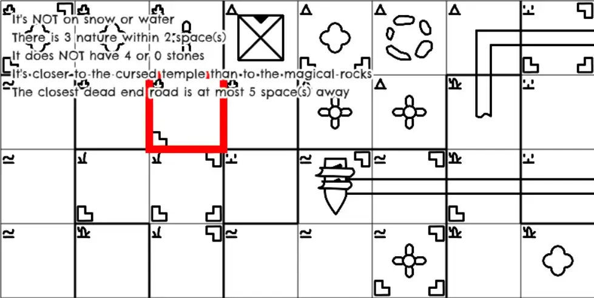

As you can see, you can't really distinguish it from the final results
of the *backward* algorithm.

Behind the scenes I can see that generation often doesn't need retries
and is thus quicker/more robust.

For example, the *map* needed 11 retries to be formed, but the *hints*
were perfect first try.

But besides that? This algorithm *feels* like it's a cleaner and better
method, but in practice I don't see it as a clear winner over the
"backward" algorithm. It was way harder to implement and we need to
throw away many of the hints anyway in the end.

## How to apply this in a game?

Using the *forward* technique (with some improvements), we're able to
generate many different scenarios for any given map: a *treasure
location* and a *set of hints* (unique to each player) leading to it.

But that's not a game. Not yet. It's just the underlying structure we
need.

Now you need a way to show the map, show the hints, and *gameplay* to
help with deducing the solution.

In these games, gameplay is all about *communicating information* in a
way that is always helpful, but also always vague. (As players are not
allowed to just tell their hints, but you still need to figure them out
somehow.)

First some practical considerations.

Once you have this algorithm that generates solutions, you can make the
game completely analog/physical:

-   Create some custom maps that look nice and print those.

-   Create hint cards with the hints printed on them. Clearly indicate
    the *player count* and *scenario number* on them.

Or you can keep it a digital, free game like I usually do:

-   Let players generate random maps themselves and print them. (Or show
    them on an iPad in the middle of the table, if they're so inclined
    to remove the physical board from boardgames :p)

-   Pass the phone around the table. It shows the unique hints for each
    player, so they can write them down on a piece of paper.

-   (I use a "seed" for the random generation, which is just a random
    string of letters, like "HUNT". This way, players can always replay
    their favorite maps, for example.)

Then the gameplay.

As it's a game about treasure hunting, something like the rules below
seems sensible.

Your main action is *digging*. Pick a square, dig there. All players
around the table tell you if that square is valid: if it contradicts any
of *their* hints, it's not.

If *all players* agree, you found the treasure! If not, place some
marker there to indicate it was wrong.

(You *could* make it harder by hiding the information. Don't say "I
agree/disagree", give players cards for that. Each player places their
card facedown in a pile, it's shuffled, then revealed. If that pile has
*at least one* disagree-card, you know it's not the treasure location,
but you don't know *who* disagreed.)

This is not enough, but it's a start. Ideas for improvements:

-   Each player has a character. You can only dig where you are. Moving
    is another action, where you stand determines any bonuses/penalties.

-   There are those "small treasures" on the map. It would keep players
    happier by achieving small successes along the way, as well as give
    its owners money they can use to do extra stuff.

-   There should be ways to directly trade or reveal some of your hints.

-   There might be a more general digging action, in which you ask
    questions about an *area* of multiple tiles, but only *one* player
    gives you their answers.

-   Being pirates, players are allowed to LIE. To keep it controlled,
    though, anyone who lied during a round must reveal this at the end.

In short, use that "treasure hunt/adventurer/pirate" theme to spice up
the game and add a second system to make it all more interesting than
just running the numbers in your head.

By digging somewhere, players reveal that *they* think it's a nice
location. If digging is completely free, however, players will just do
it willy-nilly and often pick wrong locations to throw off other
players. If you could somehow make digging more expensive, harder to
execute, it incentivizes players to be more strategical about it.

Just some ideas. As long as you have a working system behind it using
these algorithms, you can do anything you want.

## Update: generating hints of equal value

We're one week further now. I've developed the algorithms above into a
full game that's completely playable. In doing so, I did receive
confirmation that *not all hints are created equal* and that *this is a
problem*.

For example: I'd often get maps with a hint like "the treasure is next
to a landmark". But then the map only had one or two landmarks, meaning
you already narrowed the treasure location down to like 4 or 5 squares.
Just from this one hint. While another player might get "it's NOT on
desert" and still has 20 possible squares to choose from :p

Then I realized: *hey, we can actually solve this quite easily*. (It's
just going to be a bit expensive to calculate.)

Once we've generated the hints, calculate their "impact" (per player).
For example, let's say Player 1 has 2 hints.

-   Start with a list of all locations

-   Remove those that don't comply with hint 1

-   Remove those that don't comply with hint 2

-   Count how many possible squares are left over.

Ideally, each player has *roughly* the same number of possible squares
when looking at *their hints only*.

After calculating these values, we compare them. And if the difference
between the players is too big, we fail the hint generation and try
again.

Doing this also gave me some interesting information, which I should've
had a week ago :p Namely: how many options are actually left for a
player *at game start*?

This turned out to vary *wildly*, as I suspected. Many games had
something like two players with \~5 spaces left, and others with \~25
spaces left.

I added the following restrictions:

-   There may be no more difference in spaces left (between players)
    than 33% of the map

-   At least 25% of spaces must be left

-   At most 75% of spaces must be left

Why? I started with restriction #1 and numbers that felt sensible.

That was too strict: generation took way too long. It also wasn't always
great, because it could lead to games where *every player* only had \~5
possible spaces left. (Or all of them had hints that only ruled out like
one specific square :p)

So I added the second two restrictions. And then I relaxed the numbers a
bit until I consistently received results within a second.

Below is the first map made that way:

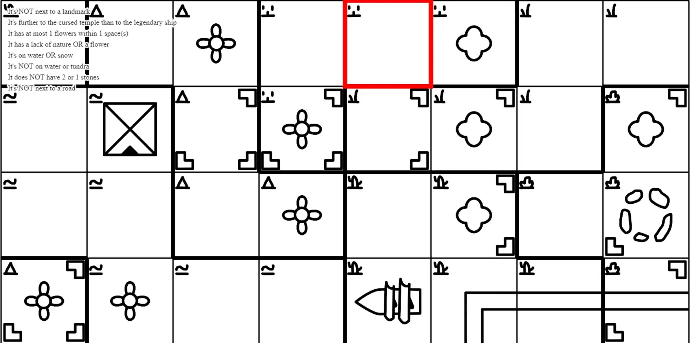

It's still not perfectly balanced. That only happens some of the games.
But the starting options for the players (with this particular game)
were: \[18, 18, 12, 8\].

So player 1 had 18 options at game start, player 4 had only 8. Yes,
slightly unfair games can happen.

But *most* of the time the numbers are all around the \~15 range.

And the advantage isn't as big as you'd think: yes, you have fewer
options to consider right from the start, but it also means that other
player's hints are more *vague* and thus harder for you to discover.

(Technical note: there *is* a check within the loop that tracks how long
we've been trying. The longer it's been, the more these numbers are
"relaxed". It's more important to me that the generation never gets
stuck and always returns a game within a reasonable amount of time.)

Here's one last map to finish this part of the article! Starting options
are: \[18, 20, 10, 13\]

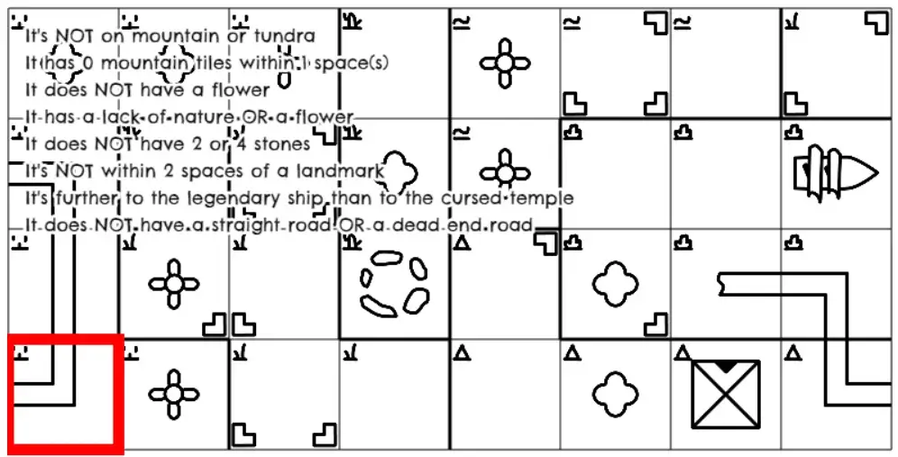

# The other approach

This article became quite long, and the games I made from it ended up
completely different and separate.

As such, the second approach (the *active* one, where you *actively*
change the game state to match certain hints/wishes), has its own
article: [Deduction Boardgames (Part 2; Active)](/blog/tutorials/deduction-boardgames-part-2-active/)
