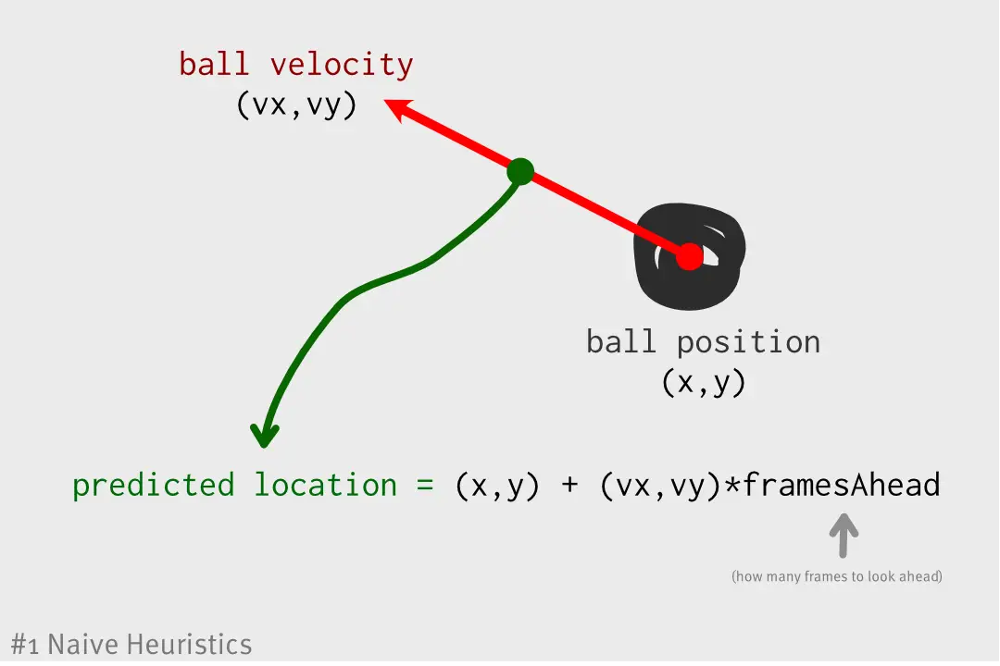
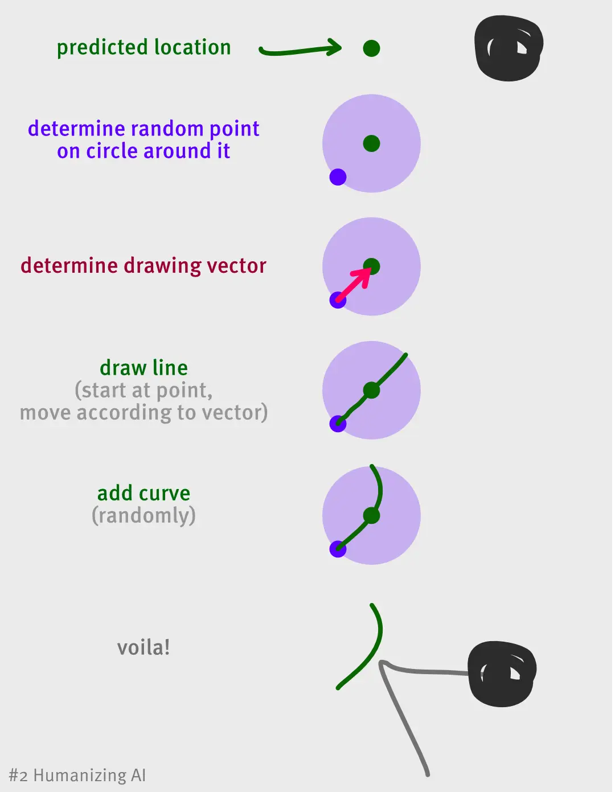
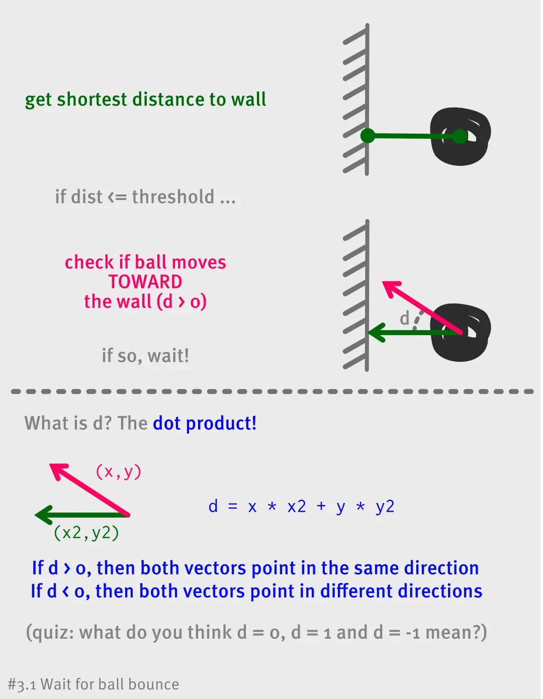
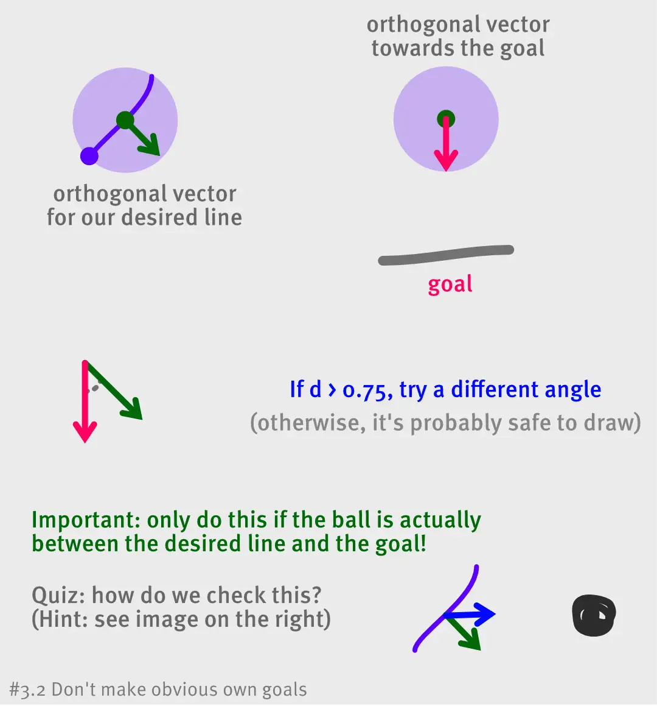
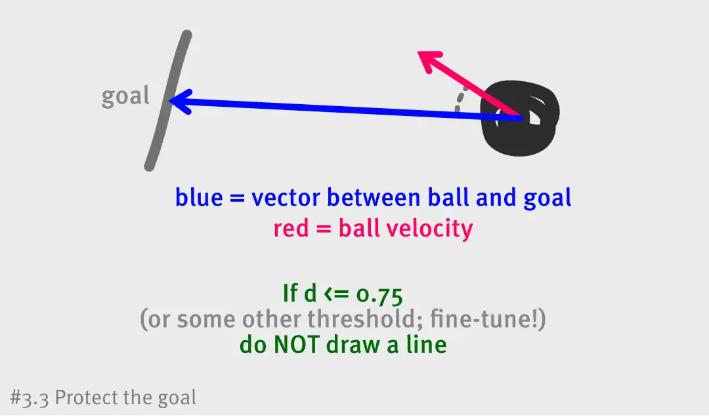

Recently, I was creating a little mobile game. I wanted to test a prototype idea, create a quick fun thing to do whenever I needed to wait somewhere, and most of all: keep it simple.

As usual, I failed miserably when I had the thought: “what if I added computer opponents to the game and trained them using some advanced machine learning techniques?!”

**In this article I will explain how you can also easily create computer opponents for your games, using my own little game as an example.**

This article is the start of a series with the following parts:
* Heuristic AI
* Machine Learning AI
* Strategic AI

The first part is an introduction to artificial intelligence. It explains some very simple concepts, tricks and rules you can apply to almost anything.

The second part uses neural networks in an attempt to create very intelligent computer players. It’s significantly more complex/advanced, but very powerful in the right circumstances.

The third part will look at “strategic AI” or “task-based AI”. Like the ones you find in strategy or (colony) management games, such as Age of Empires.

## What is the perfect AI?
You might have stumbled upon this article expecting a perfect and complete solution to all AI problems. Maybe you even expect me to show an extremely good computer opponent at the end.

I won’t.

I mean, how do you even define a “perfect computer opponent”? 

A computer that is unbeatable by humans is essentially worthless, because it’s no fun to play against. 

A computer that is good but always does the same thing(s), is predictable and thus easy to beat for humans.

This article aims to provide techniques for creating a humanlike and fun computer opponent. I want to show what is possible and how to implement certain things. 

I do not claim that there will be a “perfect AI” at the end, but I do promise to give you tools and new ideas for getting close to a perfect AI in your own games!

## What’s the idea?
I created a simple game to test these ideas. It’s Air Hockey, but instead of moving around a paddle, you can only draw lines on the screen. 

See the video below, which is two computers playing against each other:

[plugin:youtube](https://youtu.be/VsTWFqZDuv4)

To spice up the gameplay, there are a few other rules:
* You have a maximum line length (“maximum ink reserve”)
* You can only draw one line at a time.
* After a few seconds, your previous line fades away … and turns into your new goal!

These rules are, in my opinion, enhancements to the original idea of Air Hockey (which is basically Pong) and provide a greater challenge to computer players.

(Check the official game page, or play the game, to see more of the mechanics at play: [Art Hockey: Multiplayer Drawing Sport](http://pandaqi.com/art-hockey))

## Heuristic AI
A **heuristic** is nothing more than a **shortcut solution** or a **rule of thumb**. 

We (humans) use heuristics all the time. Want to go to the third floor of a building? Hmm, the elevator is probably faster than the stairs. Want to make warm chocolate milk? Hmm, shouldn’t add too much milk (because the cup will overflow), also shouldn’t add too little. 

We have all these little rules, principles and estimations we use all the time to define our actions. We can guess someone’s age or gender by looking at their hands or maybe even their clothes or their preferences. We might be wrong – these are just generalizations based on past experiences – but that’s what heuristics are and how we use them.

We’re going to make up our own heuristics for the AI!

We want to invent a simple set of rules and calculations that can solve most problems in a mostly successful manner.

## \#1: Naïve heuristics
There are no rules for this. It comes down to brainstorming about all the aspects of your game and applying some common sense.

For my example game, the heuristics I initially came up with are …
* Predict where the ball is heading.
* Whenever we can draw a new line, immediately draw one in front of the ball.
* (But make this line as short as possible, to not waste ink or risk creating a big goal.)

Pretty simple, right? 

To implement this, you only need some basic logic and linear algebra. We’ll be using a LOT of vectors and dot products.

Don’t worry if you don’t understand all of this immediately, just try to get the basic idea of what we’re doing.

**Does this work?** It works very well … too well. 

I could only beat the computer if I was very lucky: 
* The computer accidentally shot the ball against its own goal
* The computer drew a line _just_ before the ball bounced off the wall and changed direction
* It took _just_ too long for the previous line to disappear, giving me a chance to hit the computer.

**What’s the problem?** The computer doesn’t behave like a human. It can draw lines infinitely quickly, which a human cannot do. It has no sense of the game world or strategy, and doesn’t really attack nor defend.

## \#2: Humanizing AI
A human would draw actual lines, instead of placing a dot exactly where the ball will go. 

Those lines would also have a lot of variance: length, shape, angle, speed.

We want to make the computer random by varying those properties. We want to allow it to make errors, but not such grave errors that it plays like a drunken lunatic.

For this, I used a concept that is actually very common in games: 
* Start off perfectly (by drawing perfect lines as described above)
* Then introduce the variations.
* But keep those variations within a certain range.

For this specific game, the process is better explained with an image:

_Note:_ Of course, we don't draw the line instantaneously. Because we have our "movement vector", we can just take a small step every frame, until our ink runs out. This way, you can actually see the computer drawing the line, as it takes ~0.5 seconds to complete.

_Note:_ There are many ways to add the curve/variation to the line. I used a simple technique where I calculated the orthogonal vector to the movement vector. (If your movement vector is (x,y), then the orthogonal is simply (-y, x).) Then, I added this vector to the line, and every frame I increased its influence. There are many other ways: sine waves, bezier curves, etc.

All values you see here (the size of the circle, the angle, how many frames to look ahead, etc.) can be randomized within certain boundaries. For example, the radius of this circle is always between 0 and 50 in my current code. A radius higher than 50 is simply unusable, because the computer would need a lot of ink, and would probably arrive too late to actually hit the ball.

## \#3: Tactics
Now the computer isn't perfect anymore, and it actually looks like a human drawing semi-wobbly lines.

Let’s see if we can make the computer a little smarter.
* Don’t get fooled by ball bounces.
* Don’t shoot the ball towards your own goal
* Defend your own goal
* Do not waste lines

### \#3.1 Ball bounces
There are several ways to solve this. 

You could predict the path of the ball, including bounces, but there are a few problems with that:
•	It’s expensive to calculate all those physics 
•	And it’s still unreliable (there are many other ways the ball could change direction, such as a sudden brush stroke from an opponent).

Instead, we simply **wait**. If the ball is about to bounce off one of the walls, we just wait to see where it is going.

### \#3.15 Interesting Remark!
You might be wondering “how do humans do this?” How do we know where an object will land, or how we must move to catch a ball? 

Well, humans basically “do their best” and then update their calculations all the time. We apply many heuristics to quickly figure out where an object will _approximately_ be heading, and as we move closer to the object, we update that information.

This is a very useful and completely valid way of making AI. It can be extremely hard or expensive for a computer to calculate exactly what will happen. More often than not, there are cheaper ways to guess the result and then simply update the guess regularly.

For example: want an AI player to intercept something the player has thrown? If you’re far away, just perform a very rough estimation: go to the left if the object is to the left, go to the right otherwise. As you get closer, actually calculate the angle or the distance. When you’re very close, calculate the precise path you must take to intercept.

### \#3.2 Don’t make own goals
As you saw earlier, we have a certain fixed angle when we draw a line.

If the computer is unlucky, the angle is such that it deflects the ball towards its own goal. Because I don’t want to run a complete physics simulation, we can not 100% accurately predict how the ball will be deflected.

But, we can apply a heuristic! 

In general, if our line is facing our goal, there’s a good chance the ball will be deflected towards our goal. Thus, we simply calculate if our chosen angle would lead to an own goal, and if so, change the angle until it works out.

### \#3.3 Actually defend the goal
Right now, the computer draws lines whenever it can.

This is, however, useless if the ball is in the opponent’s area or very far away from the goal. 

Using even more dot products and vectors, we determine if the ball is moving towards our goal, and then draw a line to deflect it.

_Note:_ in this case, I added a random variable that overrides this rule. Once in a while, I want the computer to not only defend, but also attack! So, with a 25% chance, it draws a line even when the goal isn’t under threat.
_Note:_ with this system, it would happen that the computer recognized the threat, but still drew its line behind the goal. Which is, of course, hopeless. You want the line to be between the ball and the goal. So, in this case, I reduced the variance to ensure the line would be placed almost directly in front of the ball. (Remember the image from above where we draw a circle around the predicted point? Well, if we shrink that circle, we're far more likely to hit the ball before it hits our goal.)

### \#3.4 Do not waste lines
This problem was already (kind of) solved with the previous solution: the computer only draws lines when it needs to, most of the time.

In addition to the big systems above, however, I also added some finer details:
* Give preference to drawing short lines over long ones. (Shorter line = smaller goal once it’s faded away.)
* Do not start lines too near the edge. And if you end up there anyway, invert your drawing direction to move away from the edge again.
* If you have a goal near the edge of your area, try to quickly draw a line, so that the goal is quickly removed. (You're very vulnerable at the edge of your drawing area.)

Again, the idea of heuristics is to give the computer rules that are mostly true, not rules that are always perfect. You start with a few large/basic rules, then add smaller and more fine-tuned rules as needed. And when something doesn't work, first try changing the values and thresholds (fine-tuning the parameters), because that can make all the difference.

## Advantages vs Disadvantages
With just the rulesets described above, I was able to implement a computer opponent that (mostly) feels like you’re playing a competent human. Even better: 
* It’s cheap to compute (every frame, even for 4 computer players)
* Easy to code and maintain (only about 200 lines of code, and I use a LOT of whitespace and comments) 
* Only took a few hours to implement. 
* (Of course, polishing and fine-tuning parameters took another few hours. It always takes longer than you think …)

In case you hadn't already noticed, however, the current system also has some flaws. 
* The computer can only do exactly what we tell it to do. It can't come up with its own strategies or surprise us with a new tactic, which can make it boring and repetitive.
* There are quite a few situations in which the computer will do something extremely stupid. Perhaps it's a smart thing to do in the short-term, but in the long-term it will fail. Or it's a smart thing to do given information about some heuristic A, but not if you take other information into account.

To solve these problems, we can use machine learning. We don't tell the computer anything, but run an algorithm that allows it to disover strategies and relationships between game systems by itself. With a lot of training (and proper input and output), it should discover many different intelligent strategies. 

This will be the topic of the next part in this series!

## Conclusion
Here’s a video of two matches between me and computer opponents (1v1 and 1v1v1v1). I really did my best, but the computer was still a tough opponent, even though it also did some stupid things:

[plugin:youtube](https://youtu.be/k4gCr2HG3Cg)

So, what have we learned?
* You can get great results by teaching AI _heuristics_. This is especially true for quick arcade-like games, where there's a lot of room for error and it's all about predicting physics, movement, and reaction times.
* Find out general _rules of thumb_ that a human player would use and teach those to the computer.
* Start with perfect play (wherever you can) and add errors/variance on top of that. Not the other way around.
* This kind of AI relies heavily on vectors, linear algebra concepts, and smart mathematics in general. If you’re not familiar, make sure to read up on those topics and practice with them.
* Experimentation and fine-tuning is at least 50% of the work. Only by playtesting endlessly can you find the right speed, variance, strategy, thresholds, etc. for a fun and challenging AI.

This article used my own small game as an example. I hope these examples and explanations are enough for you to transfer the concepts to your own game!

If not, let me know and I’ll try to help or expand on this article with more example.

If you’re still yearning to learn more about AI, let’s continue with our next topic: making computers _train themselves_! (This article hasn't been released yet. Stay tuned!)
