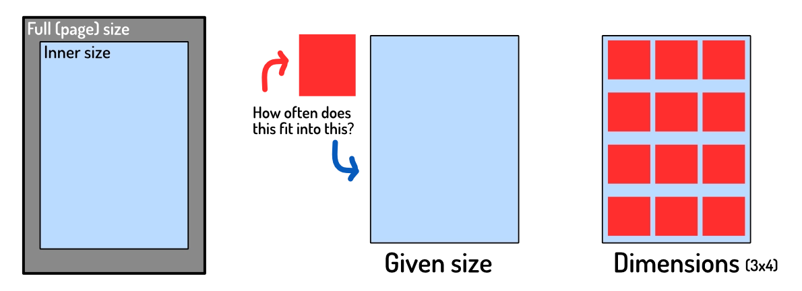
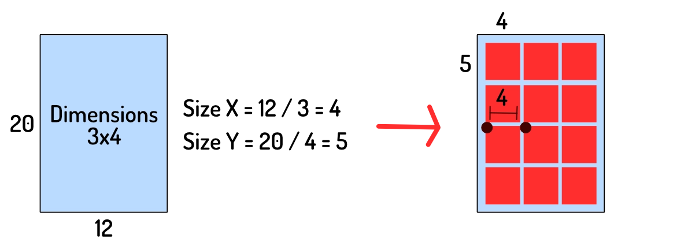
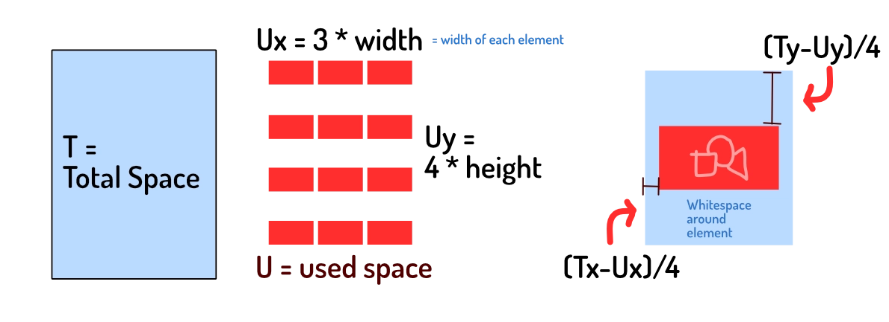
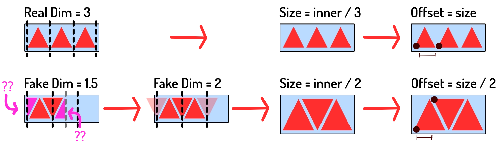
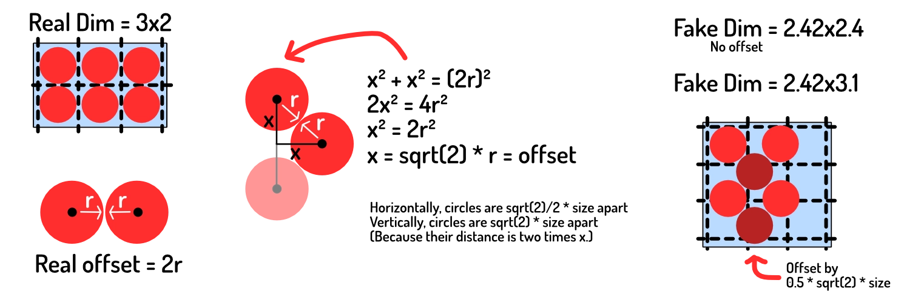
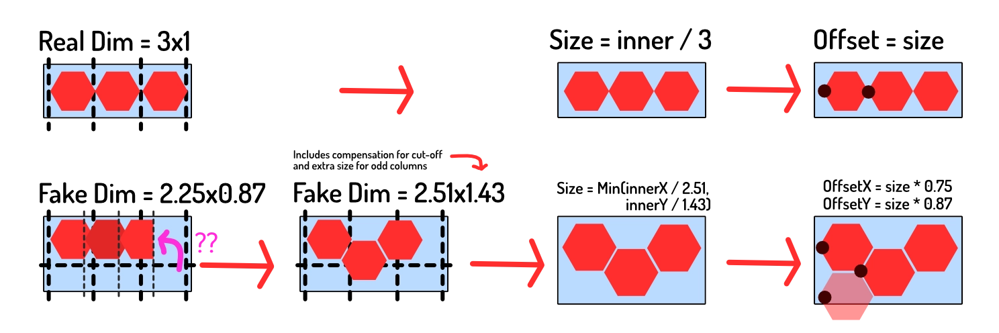

More and more (board)games from my [website](https://pandaqi.com) can be "generated" and then downloaded as a PDF. To make this easy and consistent, I wrote a simply library (called `GridMapper`) some time ago. It does nothing more than take images (or HTML canvases) as input and then _place_ them on an A4 paper in a neat grid.

For rectangles, this was easy. For any other shape or grid, however, I ran into _big_ trouble. In this article, I share what I've learned about how to create **rectangle, hexagon, triangle** and **spherical** grids and make them fit within a space (such as the boundaries of a single paper),

I write this to help anybody else with such problems, but also to help _myself_ in the future :p Because figuring this out took a while.

## A page

In my GridMapper, I can define the size and margins of a page. All games on my website simply reuse the same default value for this, but it can obviously be anything. (If you want to print on another paper size, or with more space around it, change those variables.)

The only important variable from now on is the `innerSize`, because that is the space we actually have for our elements.

## Input and Output

Grids can be input in two different ways:

* The size of one element => the system calculates the dimensions from this
* The dimensions (number of elements, horizontally and vertically) => the system scales the elements to fit

{}
I might know the exact card size I want. I want to be able to input that _size_ and let the system figure out how often it fits. At other times, I just want 5x5 tiles per page and don't care how large they are exactly.
{}

In other words, whatever input is given, it's always converted to _dimensions_ first. All examples below, therefore, use that to calculate the other values.

The output is a list of positions and sizes to use when placing each element. (And to actually create the grid, we'd just list through this data and actually _place_ each element.)

## Rectangles

Let's start with the easy one and use that as the basic idea for the rest.

Given dimensions, how large can each element be? Divide the `innerSize` by the **dimensions**.

This works because rectangles are simple and predictable. When placing them, the distance to the next element is simply the size of the rectangle. Anything else, and you'd have elements _overlap_, or waste space.

In other words: for rectangles the **distance between elements** is equal to the **size of the element**. This is _not_ true for other grid types, which is where the problems will arise.

You might not want elements to be full size. Or maybe you want elements to fill all available space, but be _square_. This will lead to empty space not being filled.

As such, we need to calculate how much space we have left, and distribute that evenly to (center) align the elements.

* Calculate `spaceUsed` by multiplying the number of elements by their size
* Subtract this from `innerSize` (the maximum space we have)
* Divide `spaceUsed` by the number of elements, and now you have the space needed around each element. Add half of it in the front and you've centered the element.

This simple system powered my website for a good year, without issues, until I needed those other types of grids.

## Triangles

For triangles to form a grid, they need to be equilateral. (All sides are equally long. You achieve this by placing the three points on a circle around the triangle's center.) Without that, they're not symmetric (both horizontally and vertically), which makes a grid impossible.

We can reuse the code above, and it'd be fine. But we'd waste a _lot_ of space. If we turn every second triangle upside down, we can shove them closer together without overlap!

The question here is of course: **how much can we move elements closer to another?** Because the answer to this determines both our grid properties:

* How many elements fit in the width/height of the area
* And how to place them exactly

First, let's check how much space we can "win". It's exactly **half the element's size**. It's not hard to judge this with the eye. You can also imagine two triangles combining to form one rectangle.

* The **offset** ( = space between elements) is half the size, not the whole size. 
* So, in the space of `1` element, we can actually place `2` elements. 

How do we use this? Given dimensions,

* Divide the dimensions by `2`
* Pretend these new dimensions are the amount of space we want to fill
* Divide page size by these new dimensions to get element size
* Place the elements at this size, `0.5 * size` apart.

We "fake" the computer into thinking it works with rectangles of a certain size. But we calculate the values in such a way that it will line up precisely when we place _triangles_ instead.

HOWEVER, there is one issue here. The thing that caused me to get stuck for such a long time and write this article.

Our calculations above would be entirely correct ... if we didn't care about broken tiles. If we start the row with half a triangle, and end it with half a triangle, then yes, we can fit precisely 2 times as many tiles in that space.

But we don't want elements to be cut off. We need to calculate the amount that is cut off and _add_ it to our fake dimensions. (So that it's taken into account _completely_.) In this case, it's literally half a triangle, so the number to add to our fake dimensions is `0.5`. Later on, we'll generalize this number for all shapes.

This way, we can reuse the simple code for rectangle grids for all the details (sizing, placement, etcetera). But the elements will be scaled to fit as much space as it can.

## Circles

When I say circular grid, I mean that the elements are circles. I don't mean a _radial_ grid, where elements are _placed_ in a circle. (That's pretty useless from a "put material on a PDF" standpoint, but very pretty for visual decorations and such.)

{}
If your elements are ellipses, there's really nothing to be gained from circle grids. Just pretend they are rectangles and use that---because they _are_ very close to rectangles, like rounded rectangles.
{}

This is the next step, because now we need to modify the grid both horizontally and vertically. (With the triangles, we only squished them horizontally, or on the X-axis.)

* Horizontally, the offset between elements is `sqrt(2) / 2` = `0.71` (relative to size)
* Vertically, the offset is double that (because we can't overlap the other circle), so `sqrt(2)` = `1.41` (relative to size)

The image below shows _where_ this number comes from. (Application of the Pythagorean Theorem.)

This means that ...

* Horizontally, in the space of `1` element, we can place `1.41` elements
* Vertically, in the space of `1` element, we can place `0.71` elements. (This seems correct, because we LOSE space on the vertical axis.)

Like before, we need to compensate for the element that's cut off. 

* Normally, in a rectangular grid, the offset between elements is 1 ( = same as size).
* The reason things get cut off, is because our offset is now some other number.
* So the part that's cut off is the difference between the new offset and 1.
* In other words: `1.0 - offset` is the remaining bit we're missing.

Doing the same thing as before, our "fake dimensions" are

* Horizontally, (dimX / 1.41) + (1.0 - 0.71)
* Vertically, (dimY / 0.71) + (1.0 - 1.41)

But wait ... wait wait wait ... something isn't right yet. Every second column needs to be offset entirely. As you see in the image, the second circle (in each row) is pushed downward. 

In other words, we actually need to fake out the algorithm one step further. We need to add `0.5 * offsetY` to our fake dims to account for that half-shape extra size on odd rows.

Everything else is the same. We use that to get "fake" dimensions, to get the actual size of elements, and use the offset we calculated for placing them. (The radius is, of course, half the element's size. And the fake dimensions do not need to be rounded, as the true dimensions still determine how many elements we place.)

## Hexagons

This is the final boss. Hexagons require a _different_ offset change in both X and Y directions, and an offset for odd rows (like circles).

Fortunately, all logic from before still holds, so all we need to do is figure out how much space we can win (in the X and Y direction).

{}
I've always preferred the flat-top layout, so that's the only one I'll discuss and probably ever use. But you can obviously create pointy-top hexagons and swap the X and Y values.
{}

The new offsets between elements are ...

* Horizontal = `3/4` = `0.75` (relative to size)
* Vertical = `sqrt(3)/2` = `0.87` (relative to size)

For any and all information about hexagons, always visit the [Red Blob Games](https://www.redblobgames.com/grids/hexagons/) article, famous and revered among game developers ;)

This means that ...

* Horizontally, in the space of `1` element, we can actually place `1.33`
* Vertically, in the space of `1` element we can actually place `1.15`

The fake dimensions become ...

* Horizontally, (dimsX / 1.33) + (1.0 - 0.75)
* Vertically, (dimsY / 1.15) + (1.0 - 0.87)

On odd columns, add `0.5 * 0.87 * sizeY` to the Y coordinate. 

The image below also provides an alternative way to see that "cut off" shape. Because we've squished the shapes together, the _last_ shape isn't included completely. That's why we need to add `1.0 - offset`, because that's the part (of that final shape) that is left out.

Hexagons are awesome---they're also the bane of my existence when it comes to developing games and grids around them.

## Conclusion

This article (hopefully) makes it very easy to follow what happens and/or implement it.

My journey towards figuring this out certainly wasn't that simple. I made many mistakes. I was stumped for a bit about how you could know the right size of elements, if you didn't know the dimensions, and vice versa. It felt like there was too little information. (I didn't realize the trick with faking the size yet.)

Then I was stuck on that leap about the "missing part" :p I just could not figure out why my calculations seemed _kinda_ off, _some of the time_. Until I drew these pictures and visualized the process. Then I saw that the last parts were being cut off and I just had to add them back in. Two lines of code ... retrieved after 4 hours of being frustrated and debugging _everything_.

It's hard to wrap your head around things like these. If my images weren't clear, tell me and I'll try to visualize it better.

But the simple values and steps above now power the GridMapper that---currently---creates nice PDFs for almost 10 completely different games with different tiles. 

I even invented a game idea that utilizes _all_ these grid types on purpose. You know, to stress test the system. (That game isn't available yet, because I only wrote the code to generate material and nothing else. But it will appear sometime in the future.)

Until next time,
Pandaqi

