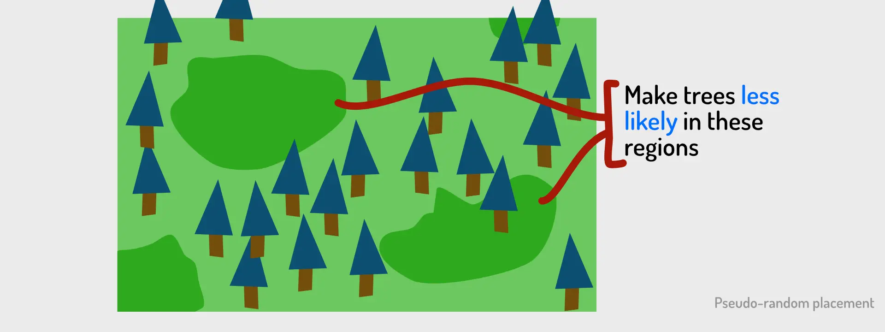
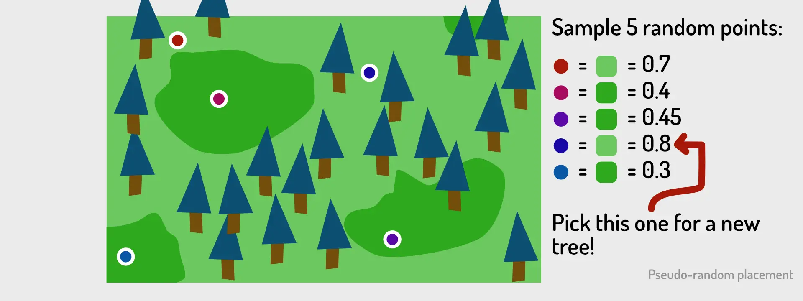

One problem has followed me my whole game dev career. It's a problem I
call "trying to place stuff pseudo-randomly"

What does this mean? Let's say we want to generate a random map at the
start of a new game. As such, we want to *randomly* place
houses/trees/roads/whatever we need in the game.

But, real randomness isn't pretty to look at nor fun to play.
(Especially if you're trying to imitate something human-built, like
towns.) Usually, there are different "highlight areas" on the map where
we want *loads of stuff to be placed*, and other areas which can be
*mostly empty.*

In other words, we want to place things randomly, but *with different
probabilities at different locations*.

And somehow, I've never been able to find a simple, fast, general
solution to this until now!

This is what I did before:

-   In really simple games, I would just define these areas as circles.
    Within each circle, I'd place X things (at random positions).
    Outside of that, I'd place nothing, or much fewer things (like
    0.1 \* X)

-   In more difficult games, I would always resort to a *grid* and a
    *noise map*. Something like "Perlin noise" creates an image which
    automatically has similar values clumped together. So, each grid
    cell reads its value from that image, and uses that as the
    probability when asking the question: "do I want to place something
    here?"

But these were bad solutions. Not each game has a grid (or can even use
one), and the circle solution only works for *very* simple games.

And then I watched a [random video](https://www.youtube.com/watch?v=PGk0rnyTa1U).

It's from a game developer who, you know, casually said this
(paraphrasing): 

> "I drew a heatmap, where lighter values are higher. For
> each thing I wanted to place, I simply created a handful of random
> points, and picked the one *with the highest value in the heatmap*."

Simple! It works! And by drawing the heatmap (or potentially generating
it randomly, from e.g. Pelin noise) you completely *control* the density
of certain areas on the map.

Not perfect, of course. It can still happen that things are way more
randomly distributed than you'd like. But the probability of that
happening is *extremely low*. And more importantly: it's a risk you'll
always have when doing random generation.

That's it. That's the whole article. Really, I've searched for this a
long time and can't believe I never thought of this myself.

Until the next time,

Pandaqi
