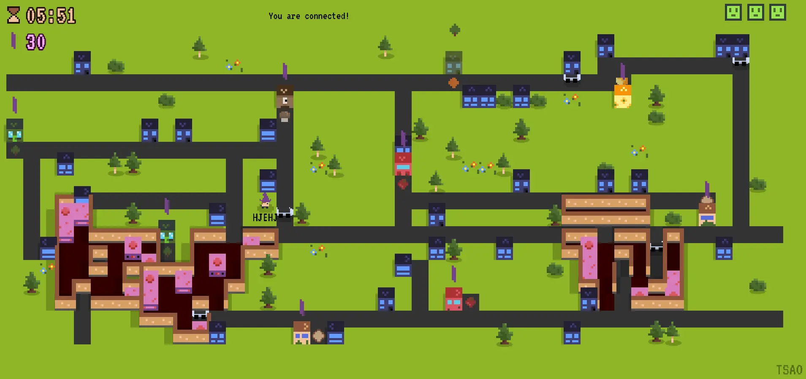
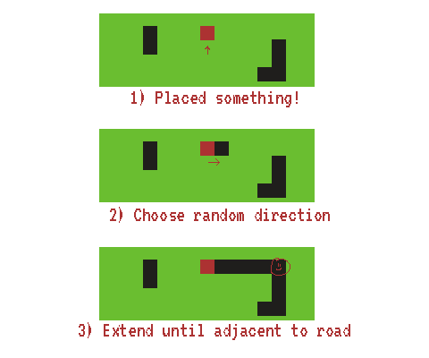
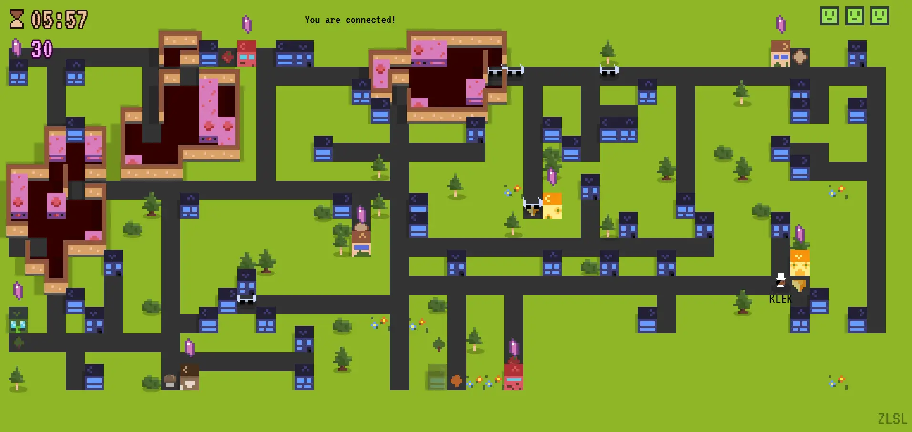
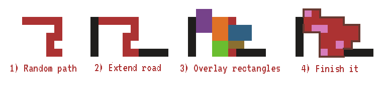

This is part 7 in my article series about how I created "Pizza Peers".

Haven't read the other entries? Go to the [devlog overview](../).

This is what the average city in the game "Pizza Peers" looks like:

There are ingredient locations, lots of regular buildings, and roads
that logically (and efficiently) connect them.

On top of that, there are three kitchens (or "workspaces") which must
contain X amount of tables and ovens, and which must be walkable. (If
you can't go inside the kitchens or reach any of the tables/ovens, they
are worthless and the game becomes impossible.)

Today I want to share how I generate these elements.

(When expressed in code, these algorithms are quite heavy, which is why
I'm not sharing any code. Check the source code if you want to see the
exact implementation.)

"Extend Road"
-------------

All the algorithms are powered by the the "extend road" algorithm.

It does the following:

-   We've just placed something at grid location (x,y)

-   Check if we are already connected with a road.

-   If not, pick a random side (that is available)

-   Now continue this road in a straight line until you are ...

    -   Adjacent to an existing road;

    -   Or you've reached the edge of the map

Here's an image for extra clarity:

The first few things we place will get a road leading to the edge of the
map. Those automatically become the "main streets" of the city.

All subsequently placed buildings will create a road connecting to one
of the existing roads, which leads to a mostly realistic and
good-looking road network. (It's not perfect, of course, but I chose
simplicity over complexity for this game.)

Because of the grid structure, once an *adjacent cell* is already a
road, we are automatically connected to a road. Because this adjacent
cell could be anywhere (left/right/top/bottom) we automatically get
corners and curves in the road for free!

(Additionally, the road is as short as possible, and we don't get ugly
rectangles with multiple parallel roads.)

Kitchens
--------

As expressed in the introduction, kitchens have one important property:
**you need to be able to walk from one entrance to another**. No
tables/walls may block your way. Instead, they must be to the side of
the path, so you can easily reach them.

See the screenshot below for how this looks in practice. The dark red floor (with beige walls around it) marks a kitchen. Openings in the walls are entrances to the kitchen, and the purple things are tables/ovens.

Whenever you encounter such a problem, it's usually wise to take the
reverse approach. Don't build a kitchen and then check if it's walkable.
Build a path and then model the kitchen around it.

**Step 1:** create a random path, starting from a random location (x,y)

> For this, I used the random path algorithm expressed here:
> <https://gamedev.stackexchange.com/questions/162915/creating-random-path-in-grid>

**Step 2:** use "extend road" on the start and end point.

> This ensure we have two openings, which are reachable and connected to
> a road.

**Step 3:** randomly overlay the path with rectangles

> Pick any cell from the random path. Now draw a rectangle around it of
> random size (2x2, 2x3, 3x2, ...) Mark all those cells as part of the
> kitchen. Continue until the kitchen is large enough (cells.length \>
> someNumber).

**(Step 4:** loop through the cells and place walls whenever an edge is
connected with the outside world.)

**Step 5:** pick random cells within the kitchen, *excluding those from
the random path*. Place tables and ovens there.

The random location (x,y) of the kitchen can be anywhere, although I
made sure it had at least distance 10 to another kitchen, and distance 3
to the edge.

Buildings
---------

Knowing the previous algorithm, placing buildings is trivial:

-   Place building (regular buildings can be anywhere, ingredient
    buildings are spaced apart as much as possible)

-   "Extend road"

... that's it. As I said: the "extend road" algorithm does a wonderful
job jelling these naïve algorithms together.

Pixel Art
---------

In an effort to keep this game simple, I imposed a harsh restriction on
myself: all sprites had to be 8x8 pixels. That's not a lot of room. This is the complete spritesheet for all possible ingredients and pizza combinations:

(For those paying attention: yes, I decided to index combinations using binary numbers. For example, 20 = 10100 means a pizza has ingredient 1 and 3, and none of the others.)

As it turns out, buildings aren't square, so this requirement changed to
8x11 along the way. Here's the whole 8x11 spritesheet:

I must say that this restriction was a blessing. It allowed me to very
quickly make art for the game, keeping everything simple and clean. At
the same time, I think the game looks quite cute and fun, even though I
only had very few pixels for every element.

(Some elements are more detailed, such as characters and vehicles. They
are 16x16. But most are 8x8 or 8x11.)

Using pixel art also makes animating much easier. In most cases, it's a
matter of smartly displacing some pixels or shifting colors, then
playing a spritesheet animation. It's a simple thing, but making
everything *move* and *respond to input* makes a game feel much more
alive.

It's my first attempt at pixel art, but I like it so much that all
subsequent peer-to-peer games might just be using this art style ...

(Yeah, yeah, I know this game isn't exactly a prime example of
gorgeousness. I'm just trying to explain why I like pixel art and why I
think some parts helped the game a lot.)

Conclusion
----------

It may sound very simple now, but it took me a long time to find such
elegant approaches and implement them (without entering infinite loops
or creating awkwardly shaped kitchens).

The kitchen algorithm was already my third try. (At which point, I must
admit, my positive state of mind was quickly deteriorating.)

However, I think this does provide a wonderful introduction to
procedural generation to anyone wanting to learn about that topic. Using
something as simple as these building blocks can already get you very
far.

I think that's all I want to say about this game.

Play it! Have fun together! Introduce your (grand)parents or your kids!

Hopefully you learnt something from this article series, and hopefully I
am able to play *your* cool peer-to-peer multiplayer game soon.

Until next time,

Pandaqi